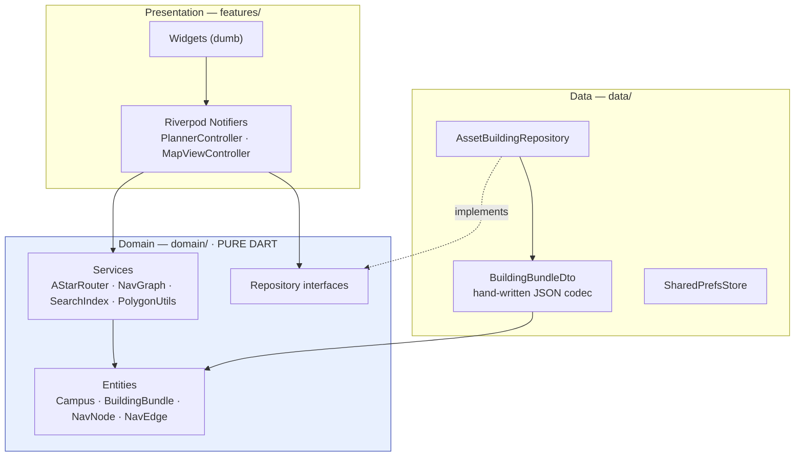
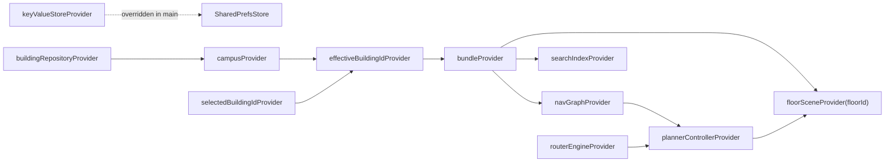
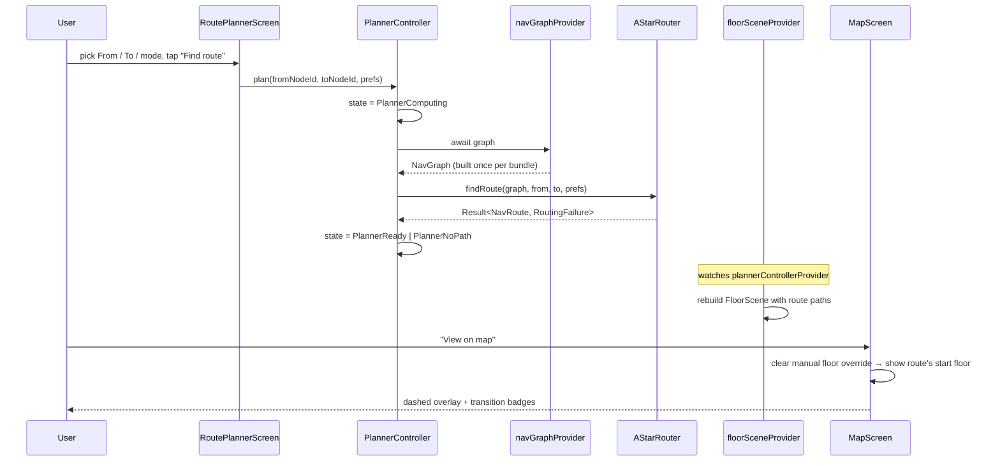
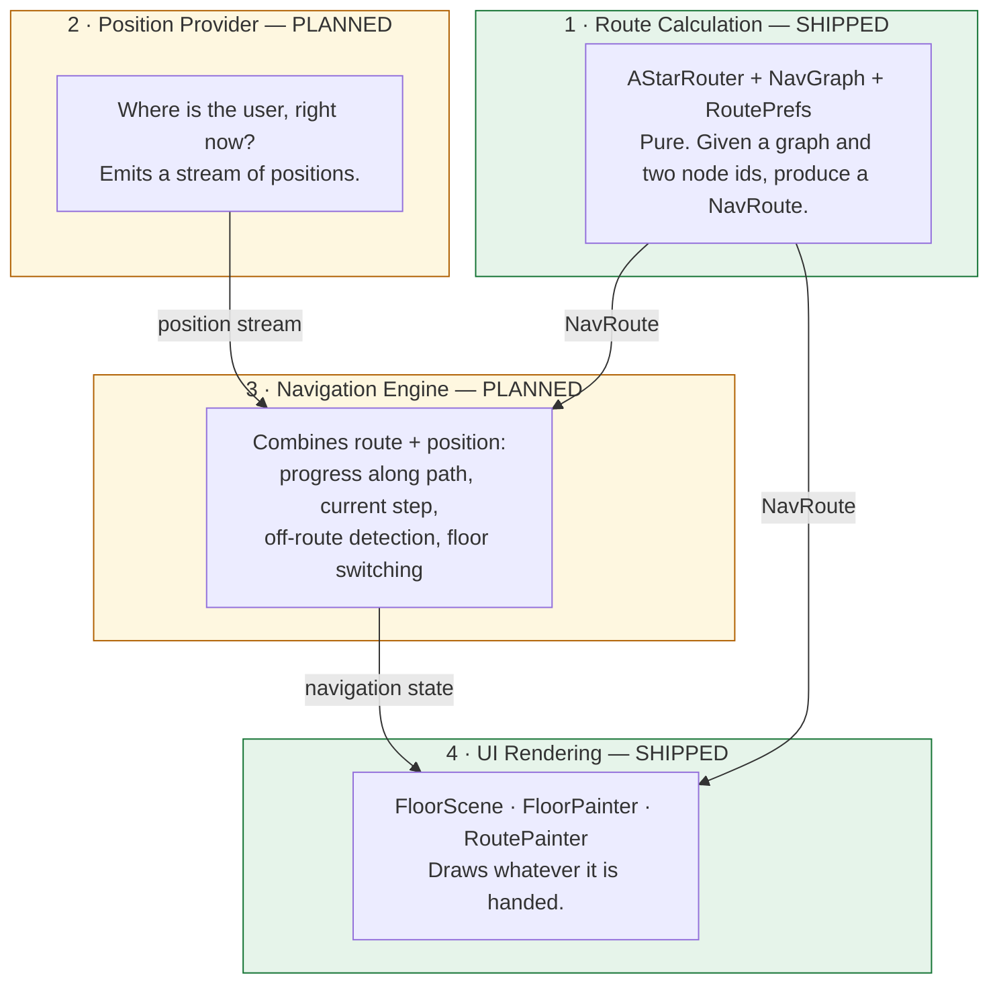
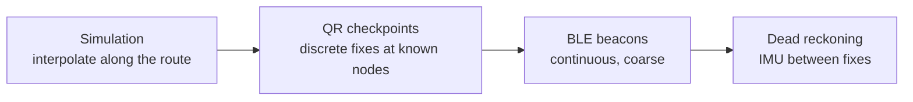

# UniNav — System Architecture

> **Status:** current as of the MVP build (`app/pubspec.yaml` version `0.1.0+1`).
> Describes code that exists. Sections marked **Planned** are design intent with no implementation yet.

Related: [SRS](01-srs.md) · [Data model](03-data-model.md) · [Routing engine](04-routing-engine.md) · [Navigation runtime](18-navigation-runtime.md) · [Roadmap](14-roadmap.md)

---

## 1. Guiding decisions (and why)

Each of these is a decision that would be expensive to reverse later. They are recorded with their reasoning so a future contributor can tell an intentional constraint from an accident.

### 1.1 Map data is data, never code

There is no `if (campus == 'vit-vellore')` anywhere in `lib/`. A venue is a `campus.json` plus one bundle per building. The consequence: onboarding a new campus is a data task, not a development task, and the same binary serves a university, a mall or a hospital.

The cost of this decision is that *everything* venue-specific has to be expressible in the schema. When something isn't — corridor shapes, for instance — the schema grows ([03-data-model.md](03-data-model.md)) rather than the code growing a special case.

### 1.2 Offline-first, bundle-based data

The unit of download is a **versioned building bundle**: one JSON blob containing floors, rooms, POIs, nodes and edges. Not per-document reads.

A 500-room building is one file read instead of 500 document reads. That single choice is what makes offline-first, low running cost, rollback and community moderation all *possible*; the alternative (normalised rooms as documents) forecloses all four at once.

Today bundles ship inside the APK as Flutter assets. The remote tier is **Planned** (see §7).

### 1.3 Pure-Dart domain core

The routing engine, navigation graph, search index and geometry helpers have zero `package:flutter` and zero Firebase imports. Verify with:

```bash
cd app && ! grep -rq "package:flutter" lib/domain/
```

Consequences worth the constraint:

- Correctness is testable on the plain Dart VM — fast, no widget harness, no golden files.
- The same code can run in a future admin web tool or a CLI without a rewrite. `tool/survey/survey_to_bundle.dart` already does exactly this: it imports `NavGraph` from the domain layer and runs the app's own validation offline.
- `Point2` exists instead of Flutter's `Offset` purely to hold this line. That is the price, and it is one small class.

### 1.4 Feature-first presentation, shared domain

`domain/` and `data/` are top-level; only presentation is organised per feature. Rooms, the graph and routing are used by search, map, navigation and (later) contribution alike — duplicating them per feature would force cross-feature imports anyway, which is worse than a shared core.

### 1.5 Use-case classes only where they earn their keep

Textbook Clean Architecture puts a use-case class between controller and repository. UniNav has none, deliberately: every current interaction is a single call to a repository or a pure service. A `ComputeRoute` class wrapping one call to `AStarRouter.findRoute` is ceremony, and ceremony is technical debt too. They will be introduced when a flow genuinely orchestrates several collaborators — contribution submission is the first candidate.

### 1.6 Navigation is four replaceable layers

Route calculation, position sensing, progress tracking and rendering are kept strictly separate, so that swapping simulated positioning for real indoor positioning later touches exactly one of them. This is the architectural core of the MVP direction and is set out in full in **§8**.

---

## 2. Layering



**Dependency rule:** outer depends on inner. `domain/` depends on nothing but `dart:*` and `package:collection`.

---

## 3. Folder structure (actual)

```
app/lib/
  main.dart                          # bootstrap: resolve SharedPreferences, override provider, runApp
  app/
    app.dart                         # MaterialApp.router, M3 theme (seed #3F51B5), themeMode from prefs
    providers.dart                   # the DI container — repository, router engine, campus, bundle, graph
    router/app_router.dart           # GoRouter config + onboarding redirect + errorBuilder
  core/
    error/failure.dart               # sealed Failure hierarchy
    result/result.dart               # sealed Result<T, E> (Ok | Err)
    storage/key_value_store.dart     # persistence seam + InMemoryKeyValueStore
    widgets/back_or_home_button.dart # deep-link-safe AppBar leading
  domain/                            # PURE DART
    entities/
      geometry.dart                  # Point2
      nav.dart                       # NavNode, NodeKind, NavEdge, EdgeKind
      campus.dart                    # Campus, BuildingSummary, BuildingStatus
      building_bundle.dart           # BuildingBundle, Floor, Room, RoomType, Poi, PoiType
    repositories/building_repository.dart
    services/
      routing/nav_graph.dart         # adjacency list + build-time validation
      routing/astar_router.dart      # A* / Dijkstra, nearest-of-many, route assembly, instructions
      routing/route.dart             # NavRoute, RouteSegment, RouteTransition, RouteInstruction
      routing/route_prefs.dart       # edge-weight policy (fastest | accessible | preferLift)
      search/search_index.dart       # tokeniser, scoring, bounded Damerau-Levenshtein
      geometry/polygon_utils.dart    # point-in-polygon, distance-to-segment, bounds
  data/
    dtos/building_bundle_dto.dart    # hand-written bundle codec (fromJson / toJson)
    repositories/asset_building_repository.dart
    sources/shared_prefs_store.dart
  features/
    home/                            # campus overview, building list, favourites row
    search/                          # debounced search screen + index/query/recents providers
    map/                             # FloorScene, FloorPainter, RoutePainter, MapScreen, MapViewController
    navigation/                      # RoutePlannerScreen + PlannerController state machine
    settings/                        # AppPrefs, favourites, theme + default route mode
    onboarding/                      # two-page first-run intro + onboardedProvider
    feedback/                        # offline report outbox + report sheet
app/tool/
  tracer/index.html                  # browser floor-plan tracer (zero-install)
  survey/floorplan_to_bundle.dart    # traced plan JSON  -> bundle   (pipeline in use)
  survey/survey_parser.dart          # .survey text format parser
  survey/survey_to_bundle.dart       # paced field notes -> bundle   (alternative pipeline)
app/assets/campuses/
  vit-vellore/{campus.json, bundle_SJT.json}
  demo/{campus.json, bundle_main.json}
  maps/sjt/                          # floor plan images + traced floor_N.json sources
app/test/                            # mirrors lib/ + tool/
```

Feature folders contain only `presentation/` today. That is not an omission — no feature yet owns domain logic of its own.

---

## 4. State management: Riverpod as the DI container

There is no `get_it`, no service locator, no manual injection. Providers are the single mechanism, and they are compile-time safe.

The provider graph in `app/providers.dart` is a dependency chain — each level derives from the one above:



Three properties this buys:

1. **Testability without mocking frameworks.** A test overrides `buildingRepositoryProvider` with a fixture loader, or `keyValueStoreProvider` with `InMemoryKeyValueStore`, and everything downstream is real code under test.
2. **A build-time swap for the Firebase tier.** `AssetBuildingRepository` will be replaced by a Firebase implementation of the same interface; nothing above `buildingRepositoryProvider` changes.
3. **Automatic invalidation.** Change the selected building and the bundle, graph, search index and every floor scene rebuild — because they are derived, not copied.

### 4.1 Sealed state machines, not boolean soup

`PlannerState` is sealed:

```dart
sealed class PlannerState {}
final class PlannerIdle      extends PlannerState {}
final class PlannerComputing extends PlannerState {}
final class PlannerReady     extends PlannerState { final NavRoute route; }
final class PlannerNoPath    extends PlannerState { final RoutingFailureReason reason; }
final class PlannerError     extends PlannerState { final String message; }
```

Because the type is sealed, a `switch` in the UI is exhaustive and the compiler rejects a build that forgets a case. This is what makes "no step-free route exists" impossible to accidentally render as a generic spinner — the distinction lives in the type system, not in a developer's memory.

`MapViewState` is a `Notifier` rather than two `StateProvider`s because its two fields share an invariant: selecting a room implies showing that room's floor. Split into independent providers, that invariant would be enforceable only by convention.

---

## 5. Data flow: computing and showing a route



Two subtleties in that flow worth knowing:

- **`FloorScene` is rebuilt, not mutated.** It is an immutable render model keyed by `(bundle, floorId, route)`; all `Path` objects are constructed once at build time so the painters allocate nothing per frame ([11-performance.md](11-performance.md)).
- **A new route clears the sticky floor.** Without this, planning a route and tapping "View on map" landed the user on whichever floor they last browsed. `MapScreen` listens for the `PlannerReady` transition and calls `clearFloorOverride()` post-frame.

---

## 6. Error handling

### 6.1 `Result`, not exceptions, at the boundary

```dart
sealed class Result<T, E> { … }   // Ok<T,E> | Err<T,E>
```

"No path exists" and "this building isn't mapped" are **expected outcomes**, not exceptional conditions. Modelling them as exceptions means the compiler cannot tell you when you forgot to handle one; modelling them as a sealed `Result` means it can. `fold` forces both branches to be written.

Exceptions remain for programmer errors and genuinely exceptional IO — the repository is the single translation point.

### 6.2 The `Failure` hierarchy

```dart
sealed class Failure { final String message; }
  NetworkFailure · NotFoundFailure · DataFormatFailure · PermissionFailure
  RoutingFailure(message, RoutingFailureReason reason)

enum RoutingFailureReason { noPathForConstraints, disconnected, nodeMissing }
```

`noPathForConstraints` and `disconnected` are separate members for a user-facing reason: *"No step-free route exists between these rooms"* and *"These rooms are not connected on the map yet"* are different facts, and conflating them tells a wheelchair user nothing useful. The router works for this distinction — when a constrained search fails it re-runs unconstrained to classify the failure honestly ([04-routing-engine.md §5](04-routing-engine.md)).

### 6.3 Corrupt data must never crash

Malformed JSON in Dart can throw `Error` subtypes (`TypeError`, `RangeError`), not just `Exception` — and `on Exception catch` will not catch those. Every parse boundary therefore uses a bare `catch`:

- `BuildingBundleDto._coord` validates every coordinate through one path, so `[1]` or `"x"` produces a readable `FormatException` instead of a `RangeError` escaping to the top.
- `AssetBuildingRepository` catches everything and returns `DataFormatFailure` / `NotFoundFailure`.
- `AppPrefs`, `FavoritesNotifier`, `RecentPicksNotifier` and `FeedbackOutboxNotifier` all fall back to empty state on corrupt persisted JSON. A bad prefs blob must never brick the app.

Unknown enum values map to a fallback rather than throwing, so an old client tolerates map data written by a newer tool.

---

## 7. Offline & caching

**Tier 1 — bundled assets (shipped).** `assets/campuses/` is compiled into the APK. First launch works with no network at all, and the same files are the test fixtures, so the format is exercised by every test run.

**Tier 2 — parsed-bundle memory cache (shipped).** `AssetBuildingRepository._bundleCache` keyed by `buildingId`; re-opening a building re-parses nothing.

**Tier 3 — local preferences (shipped).** Theme, default route mode, favourites, recents and the feedback outbox persist through `KeyValueStore`. The default binding is `InMemoryKeyValueStore`; `main()` overrides it with `SharedPrefsStore` after resolving the plugin once, so every later read is synchronous and no async plumbing leaks into providers.

**Tier 4 — remote bundle sync (Planned).** Disk cache keyed by `buildingId@version`, downloading only when the published version differs. See [14-roadmap.md](14-roadmap.md).

Because everything user-facing already reads from the cache tier, offline is the *default* path rather than a fallback branch — there is no "offline mode" to break.

---

## 8. Navigation subsystem: the four-layer separation

This is the architectural core of the MVP direction, and the reason the system can absorb real indoor positioning later without a UI rewrite.

Navigation is split into **four independent concerns**, each with one responsibility and a narrow interface:



### 8.1 Why the split matters

The whole point is that **layer 2 is replaceable without touching layers 1, 3 or 4.** Indoor positioning is an unsolved, hardware-dependent, research-grade problem. Committing the UI to any one approach would mean rewriting the UI each time the approach changes.

The intended progression — each step swapping only the Position Provider implementation:



Every one of those produces the same thing — a position — so every one plugs into the same Navigation Engine and paints through the same `RoutePainter`.

### 8.2 Honest current status

| Layer | Status | Where |
|---|---|---|
| 1 · Route Calculation | **Shipped and tested** | `domain/services/routing/` |
| 2 · Position Provider | **Not implemented** | — |
| 3 · Navigation Engine | **Not implemented** | — |
| 4 · UI Rendering | **Shipped** | `features/map/presentation/` |

> **The animated navigation blob does not exist yet.** What ships today is a *dashed-line marching animation* on the route overlay (`RoutePainter`, driven by a one-second repeating `AnimationController`). It conveys direction of travel; it does not represent a moving user.
>
> The simulated blob — a marker interpolated along the computed path — is the next piece of work and belongs to layers 2 and 3. Full design, including the proposed interfaces, is in [18-navigation-runtime.md](18-navigation-runtime.md).

---

## 9. Build-time configuration

```bash
flutter run                              # vit-vellore (real data, partially mapped)
flutter run --dart-define=CAMPUS=demo    # fully populated demo campus
```

`AssetBuildingRepository.defaultCampusId` reads `String.fromEnvironment('CAMPUS')`, defaulting to `vit-vellore` so a release build is never accidentally shipped with demo data. The demo campus exists to exercise the full feature set — including the unmapped-building UI — while real buildings are still being surveyed.

The debug authoring grid (`FloorPainter.showGrid`) is wired to `kDebugMode`, so it cannot ship by accident.

---

## 10. Testing strategy

| Layer | Tooling | Intent | Current files |
|---|---|---|---|
| Domain | plain Dart VM | This is where correctness lives | `astar_router_test`, `nav_graph_validation_test`, `nearest_route_test`, `search_index_test`, `polygon_utils_test` |
| Data | unit + golden fixtures | Round-trip every DTO; malformed input degrades, never crashes | `building_bundle_dto_test` |
| Controllers | Riverpod overrides | State-machine transitions incl. failures | `settings_providers_test`, `feedback_outbox_test` |
| Widgets | `flutter_test` | Each screen renders every state; a11y semantics | `map_screen_test`, `floor_scene_test`, `search_screen_test` |
| Tooling | plain Dart VM | The generators are load-bearing; treat them as product code | `survey_test`, `floorplan_to_bundle_test` |

The strongest test in the suite is worth calling out: `astar_router_test` generates **100 random graphs** and asserts A* agrees with a brute-force reference Dijkstra on sampled pairs. Hand-written fixtures prove the cases you thought of; the randomised cross-check catches the ones you didn't.

**Static gates.** `analysis_options.yaml` enables `strict-casts`, `strict-inference` and `strict-raw-types` plus a curated lint set. `.github/workflows/ci.yml` runs `flutter analyze` and `flutter test` on every push and PR, deliberately unpinned to stable so CI tracks the same Flutter a `flutter upgrade` would give.

Not yet gated: `dart format --set-exit-if-changed` and coverage measurement. See [15-known-issues.md](15-known-issues.md).

---

## 11. Scalability

| Dimension | Strategy | Status |
|---|---|---|
| Data | Per-building bundles bound memory; a 100-building campus loads only what a route touches | Shipped (one building at a time) |
| Cost | Reads are O(buildings changed), never O(rooms viewed) | Design; needs the remote tier |
| Compute | Routing is on-device; the server does zero routing work | Shipped |
| Rendering | Immutable `FloorScene` + `shouldRepaint` diffing + two-painter split | Shipped |
| Team | Pure domain + feature-first presentation lets contributors work per feature | Shipped |

The known ceiling: routing runs on the main isolate. Fine at present scale (the SJT bundle is 41 nodes); move to `compute()` past roughly 3k nodes — and measure before moving ([11-performance.md](11-performance.md)).
