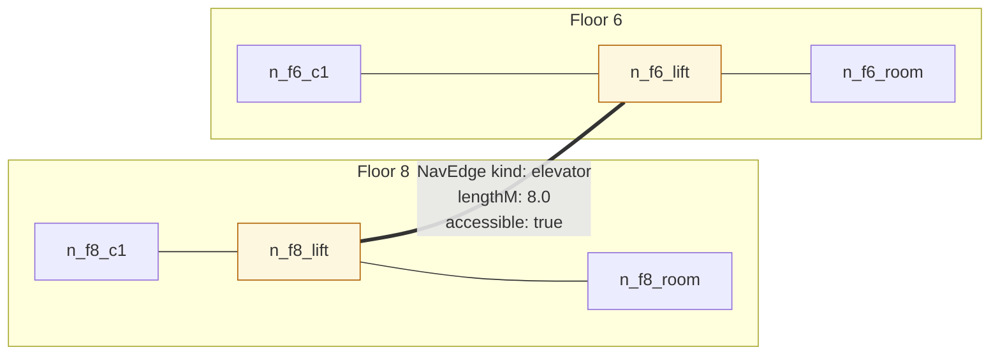
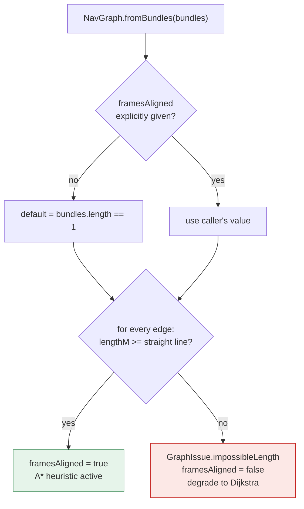
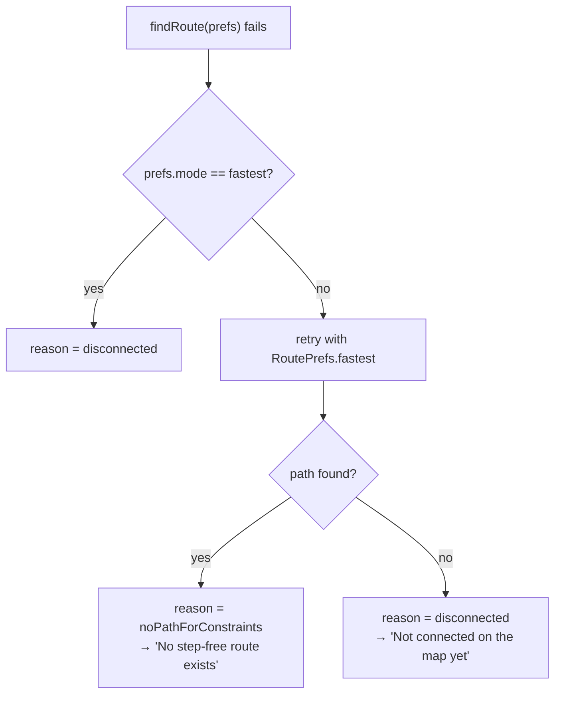

# UniNav — Indoor Routing Engine

> **Status:** fully implemented and tested. This is the most mature subsystem in the project and the technical heart of the MVP.
> Source: `app/lib/domain/services/routing/`

Related: [Architecture](02-architecture.md) · [Data model](03-data-model.md) · [Map representation](05-map-representation.md) · [Navigation runtime](18-navigation-runtime.md) · [Accessibility](10-accessibility.md)

---

## 1. Model: a graph, not a grid

Indoor spaces are corridors and doors, so a **sparse navigation graph** — nodes at doorways, junctions, stairs and lifts — beats a grid or navmesh on every axis that matters here: tiny memory, exact door-to-door semantics, and a human contributor can literally place the nodes by hand.

```dart
final class NavNode {
  final String id;
  final String floorId;
  final Point2 point;   // metres, floor-local frame, origin top-left, y grows down
  final NodeKind kind;  // room|corridor|junction|stair|elevator|ramp|entrance|exit
}

final class NavEdge {
  final String a, b;
  final EdgeKind kind;  // corridor|door|stair|elevator|ramp|outdoor
  final double lengthM; // physical walking length (for stairs: along the run)
  final bool accessible;    // false = steps, narrow door, staff-only lift…
  final bool bidirectional;
}
```

### 1.1 The single most important modelling decision

**A floor transition is an ordinary edge.** A staircase is just a `NavEdge` whose two endpoint nodes happen to sit on different floors.

There is no floor-changing branch in the search loop, no "vertical connector" special case, no per-floor sub-graph stitching. Multi-floor routing is not a feature of the algorithm — it is a consequence of the data model. The *only* place floors are noticed is in route assembly (§4), where a change in `floorId` splits the polyline and emits a "Take the lift to 8th Floor" instruction.

This uniformity is what keeps a genuinely multi-floor router down to ~380 lines including instruction generation.



### 1.2 Multi-building

`outdoor` edges connect building entrances. `NavGraph.fromBundles` accepts several bundles plus `interBundleEdges`. This works but is untested against real data, because each building's coordinates are building-local — see §3.2 for why that matters more than it sounds.

### 1.3 `NavGraph` — the immutable adjacency view

Built once per bundle load and reused for every query.

```dart
NavGraph.fromBundles(
  List<BuildingBundle> bundles, {
  bool? framesAligned,                          // default: bundles.length == 1
  List<NavEdge> interBundleEdges = const [],
})
```

Internally: `Map<String, NavNode>` for lookup, `Map<String, List<GraphArc>>` for adjacency. A `GraphArc` carries the destination id, the originating `NavEdge`, and `floorsCrossed` — precomputed at build time so the hot loop never recomputes floor deltas.

Bidirectional edges are inserted **twice**, once in each direction. Directed edges (one-way doors, turnstiles) simply are not.

### 1.4 Build-time validation

The graph reports non-fatal data problems rather than trusting its input, because community-sourced map data will be imperfect:

| `GraphIssueKind` | Meaning | Response |
|---|---|---|
| `danglingEdge` | Edge references a node id that doesn't exist | Skip the edge, keep building |
| `orphanNode` | Node with no incident edges | Report; it is unreachable |
| `duplicateNode` | Two nodes share an id | Report; last wins |
| `impossibleLength` | `lengthM` is shorter than the straight line between endpoints | Report **and disable the A\* heuristic graph-wide** |

Skipping rather than throwing is deliberate: one bad edge in a 2000-edge building should degrade that corner of the map, not make the building unopenable. The issues list is what admin tooling and the bundle generators consume as a data-quality report.

---

## 2. Weights: `RoutePrefs` as edge-cost policy

Routing preferences are expressed purely as an **edge-cost function**. The search algorithm has no idea what "accessible" means.

```dart
double? arcCost(GraphArc arc) => switch (arc.edge.kind) {
  EdgeKind.stair    => excludeStairs ? null
                       : edge.lengthM * stairMultiplier
                         + stairPenaltyPerFloorM * arc.floorsCrossed,
  EdgeKind.elevator => edge.lengthM + elevatorPenaltyM,
  EdgeKind.ramp     => edge.lengthM * rampMultiplier,
  _                 => edge.lengthM,
};
```

Costs are in **metre-equivalents**, so penalties are comparable to distances and the whole model stays intuitive: "taking the lift feels like walking an extra 15 m".

### 2.1 The three presets

| | `fastest` | `accessible` | `preferLift` |
|---|---|---|---|
| Intent | shortest walk | wheelchair / step-free | low stamina, luggage |
| `stairMultiplier` | 1× | — (excluded) | 3× |
| `stairPenaltyPerFloorM` | 5 m | — | 5 m |
| `elevatorPenaltyM` | 15 m (models waiting) | 5 m | 5 m |
| `rampMultiplier` | 1.2× | 1× | 1× |
| `excludeStairs` | no | **yes** | no |
| `excludeInaccessibleEdges` | no | **yes** | no |

The elevator's flat penalty models *waiting*; the stair penalty is *per floor* because effort scales with climb. In `accessible` mode the elevator penalty drops to 5 m — when the lift is the only option, over-penalising it just distorts comparisons between two lifts.

### 2.2 Two design points that are easy to get wrong

**`null`, not infinity, for an excluded edge.** Returning `double.infinity` would let an excluded edge silently participate in arithmetic and produce an infinite-cost "path" that looks like a result. `null` forces the caller to skip the arc explicitly, and makes exclusion visible in the type.

**Accessibility is graph filtering, not a heuristic tweak.** Stairs and `accessible: false` edges are genuinely removed from consideration. The result is therefore the *true shortest step-free path*, or an honest "no step-free route exists" — never a degraded approximation that quietly routes a wheelchair user up a staircase.

**The invariant the heuristic depends on:** every multiplier is ≥ 1 and every penalty is additive, so `arcCost(arc) >= arc.edge.lengthM` always. §3 explains why that single line is load-bearing.

---

## 3. Algorithm: A* with a Dijkstra fallback

| | Dijkstra | **A\*** | Bidirectional Dijkstra |
|---|---|---|---|
| Explores | uniformly | goal-directed | two frontiers |
| Needs an admissible heuristic | no | yes | no |
| Performance at ≤10⁴ nodes | fine (<50 ms) | best | good |
| Implementation/debug complexity | trivial | small | subtle termination conditions |

**Decision: A\* with heuristic 0 as the fallback — which *is* Dijkstra.** One implementation, two behaviours, no second code path to keep in sync.

Bidirectional search was rejected outright: its ~2× win matters at road-network scale (10⁶ nodes). At 10⁴ nodes it buys nothing measurable and costs the most debugging-prone code in all of pathfinding. That is a bad trade for a solo maintainer.

### 3.1 The heuristic

```dart
h(n) = sqrt(dxy² + dz²)
  where dxy = straight-line distance from n to the goal in the floor plane
        dz  = (floorLevel(n) - floorLevel(goal)) × assumedFloorHeightM
```

`assumedFloorHeightM = 3.5` — a physical-plausibility constant, not venue data. It lives as `NavGraph.assumedFloorHeightM` and `AStarRouter`'s constructor default references it.

**Why one constant, in one place, matters.** The same value is used in two different places: the build-time safety check (§3.2) and the search-time heuristic. If they ever disagreed, an edge could pass validation and *still* make the heuristic inadmissible at search time — silently reintroducing exactly the bug the check exists to prevent. Duplicating the literal is a latent correctness bug, not a style issue.

### 3.2 Heuristic safety — admissibility is a *data* property

This is the subtlest correctness concern in the project, and worth understanding in full.

A* returns the optimal path only if the heuristic never overestimates the remaining cost. Here that holds only while **every edge's `lengthM` is at least the straight-line distance between its endpoints**. Two realistic ways that breaks:

1. **Merging buildings.** Each building's coordinates are building-local, so "(0, 0)" means two different physical places in two bundles. Straight-line distance across them is meaningless.
2. **A mistyped length.** A contributor writes `5` where they meant `50`.

Both produce **silently suboptimal routes** — the worst possible failure mode for a navigation app, because it looks like it worked. So the heuristic is treated as opt-in and self-disabling:



**Correctness is preserved unconditionally; only search speed degrades.** A single-bundle graph gets the heuristic by default. A multi-bundle caller must opt in explicitly, after georeferencing the frames. Bad data disables the heuristic graph-wide and produces a precise report for admin tooling.

This behaviour is covered by `test/domain/routing/nav_graph_validation_test.dart`, including an explicit test that *routes remain correct on data with a bad length*.

### 3.3 Search mechanics

- `HeapPriorityQueue` from `package:collection` — O(log n) push/pop.
- **Deterministic tie-breaking by node id.** Equal-`f` nodes always pop in the same order, so routes are stable across runs. Without this, tests would flake and users would see a different-but-equally-short route on each replan.
- Stale queue entries are tolerated (a `closed` set skips them) rather than doing a decrease-key operation — simpler and, at this scale, faster.
- **The search returns arcs, not node ids.** Parallel edges between the same node pair (a stair *and* a lift between the same two lobbies) stay unambiguous, which node-id reconstruction cannot express.

### 3.4 Nearest-of-many: `findNearestRoute`

Powers "nearest washroom".

```dart
Result<NavRoute, RoutingFailure> findNearestRoute(
  NavGraph graph, {
  required String from,
  required Set<String> goals,
  RoutePrefs prefs = RoutePrefs.fastest,
})
```

It runs **uniform-cost search (heuristic 0)**, stopping at the first goal *popped* from the queue.

Why no heuristic here: a heuristic is defined relative to one goal. For a goal *set*, using `min` over goals is admissible but weak, and any single-goal heuristic is outright unsound — it would make the search prefer a farther washroom it happens to be pointed at. Under Dijkstra, the first goal popped is provably the nearest, which is exactly the guarantee needed. Correctness beats a marginal speed-up on a set of at most a few dozen goals.

---

## 4. Output contract

```dart
final class NavRoute {
  final List<String> nodeIds;              // full path, in order
  final List<RouteSegment> segments;       // pre-split per floor
  final List<RouteTransition> transitions; // interleaves 1:1 between segments
  final double totalLengthM;
  final int estSeconds;
  final List<RouteInstruction> instructions;
}

final class RouteSegment    { String floorId; List<Point2> points; double lengthM; }
final class RouteTransition { EdgeKind kind; String fromFloorId, toFloorId, atNodeId; }
final class RouteInstruction{ InstructionKind kind; String text; }

enum InstructionKind { start, walk, turnLeft, turnRight, floorChange, arrive }
```

**Segments are pre-split by floor** so the renderer and the step list consume the route directly, with no post-processing in the UI layer. `segments` and `transitions` interleave exactly — `transitions[i]` is the change between `segments[i]` and `segments[i+1]` — which is what lets `FloorScene` place departure and arrival badges without searching.

### 4.1 Time estimation

```
estSeconds = totalLengthM / 1.2 m·s⁻¹  +  Σ transition costs
```

| Transition | Cost |
|---|---|
| Lift | 40 s (call + wait + travel) |
| Stairs | 15 s × floors crossed |
| Other (ramp, door) | 10 s |

1.2 m/s is comfortable indoor walking pace. A lift costing more wall-clock time than two flights of stairs is not an accident — it is the honest answer for a single-floor hop, and the reason `preferLift` exists as a separate mode for people who need it regardless.

---

## 5. Honest failure classification

When a search fails, the router does not shrug. It re-runs the search **unconstrained** to work out *why*:



The comparison is on `prefs.mode`, not object identity — a caller-constructed `RoutePrefs` classifies the same way as the shared presets. (An earlier version used `identical()` and misclassified every custom prefs object; see [15-known-issues.md](15-known-issues.md).)

The extra search costs one traversal on a path that has *already failed*, so it is free in every case a user experiences as fast.

---

## 6. Turn-by-turn instructions

Instruction generation is a **separate pure function over the assembled route**, not part of the search. Both are then independently testable, and instruction wording can change without any risk to pathfinding.

```dart
double _turnAngleDeg(Point2 p1, Point2 p2, Point2 p3)  // signed; positive = left
```

- Threshold: **35°**. Below that it is a corridor drifting, not a turn.
- Sign is flipped because floor frames are **y-down** — in a y-down frame a positive cross product is a visually *clockwise* (right) turn, so the raw angle reads backwards. This is the single most common bug in 2-D navigation code.
- Straight runs accumulate and flush as one `Walk N m` step; runs under 0.5 m are dropped as noise.
- Floor names come from `NavGraph.floorName`, which falls back to the floor id — so incomplete data degrades visibly rather than crashing.

Instruction text is English-only and built in the engine. `InstructionKind` plus the structured fields exist precisely so localisation can replace strings later without the UI ever parsing text.

---

## 7. Correctness & performance guarantees

**Guaranteed today**

- Deterministic tie-breaking → stable, reproducible routes.
- Optimality preserved unconditionally — the heuristic self-disables rather than risking a wrong answer.
- Graph validated at build time; bad data degrades locally and is reported.
- Pure, side-effect-free, no Flutter dependency → runnable in an isolate, a CLI, or a test with no setup.

**Test coverage** (`test/domain/routing/`)

| File | What it proves |
|---|---|
| `astar_router_test` | Shortest path on a line; cheaper of two alternatives; directed edges; missing nodes; fixture routes take stairs on `fastest` and the lift on `accessible`; turn-by-turn output; **100 random graphs cross-checked against brute-force Dijkstra** |
| `nav_graph_validation_test` | Heuristic on for one bundle, off for many; explicit opt-in; impossible length flagged and heuristic disabled; **routes still correct with bad length data** |
| `nearest_route_test` | Nearest of several goals; cross-floor; start already at goal; unknown goals; constraints honoured en route |

**Not yet done**

- Routing runs on the **main isolate**. The current SJT bundle is 41 nodes and the demo 17, so this is invisible. Move `findRoute` into `compute()` past roughly 3k nodes — and measure first ([11-performance.md](11-performance.md)).
- No benchmark harness. NFR-1 in the [SRS](01-srs.md) claims <200 ms for 10k nodes; that number is currently reasoned, not measured.
