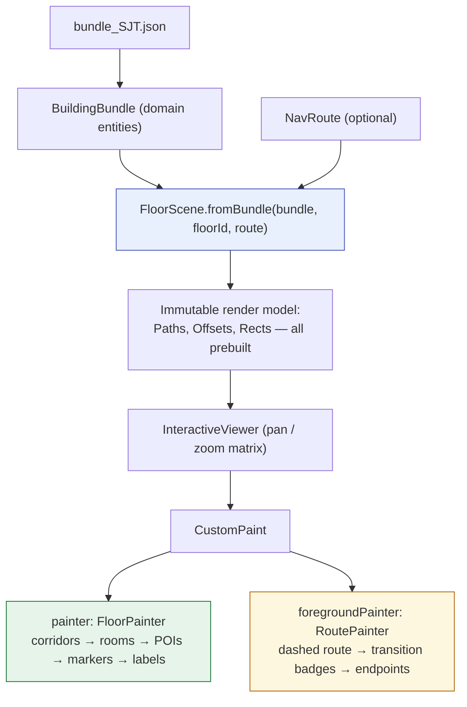

# UniNav — Map Representation & Rendering

> **Status:** the renderer is shipped. The one documented gap is the optional raster underlay (`planImagePath`), which the schema supports and the painter ignores — see §7.
> Source: `app/lib/features/map/presentation/{floor_scene,floor_painter,map_screen}.dart`

Related: [Data model](03-data-model.md) · [Architecture](02-architecture.md) · [UI screens](08-ui-screens.md) · [Performance](11-performance.md) · [Accessibility](10-accessibility.md)

---

## 1. The format decision

| Criterion | A: PNG plans | B: SVG maps | C: Pure JSON geometry | **D: Hybrid (JSON + optional raster)** |
|---|---|---|---|---|
| Authoring effort | Lowest (scan a plan) | High (vector tooling) | Medium (trace/draw) | Medium |
| Community editability | None — opaque pixels | Poor — XML diffs are hostile | **Excellent** — structured, diffable | Excellent |
| Routing support | None; graph needed anyway | Partial; graph needed anyway | **Native** — geometry and graph share coordinates | Native |
| Rendering at zoom | Blurry, huge files | Crisp; Flutter SVG perf weak on big files | Crisp via `CustomPainter` | Crisp + photographic context |
| Tap-to-identify | Hit-map hacks | Hard — SVG DOM not exposed | **Trivial** — polygons are data | Trivial |
| Size per floor | MB | Medium | **KB** | KB + optional MB |
| Versioning / moderation | Binary blobs, no diff | Poor diffs | **Semantic diffs** ("room 513 moved") | Semantic |
| Dark mode / a11y themes | No | Limited | **Yes** — renderer applies theme | Yes |

### Decision: **D — hybrid, with JSON as the single source of truth**

Geometry lives in the bundle and is painted by a custom `CustomPainter`. A raster plan image *may* be referenced (`planImagePath`) as a georeferenced underlay.

**Why not pure C.** A raster underlay dramatically lowers cold-start mapping cost — you trace over a photo of the fire-evacuation plan rather than measuring from scratch — and it gives users spatial context before an area is fully vectorised. The tracer tool (`tool/tracer/index.html`) already exploits exactly this.

**Why JSON stays canonical.** Every promise the platform makes — moderated community edits, semantic versioning, rollback, tap-to-identify, accessible theming, KB-sized offline bundles — is possible only when the map is structured data. PNG-as-truth is the classic prototype trap: it demos beautifully and then blocks routing, editing and moderation permanently. SVG is a worse JSON — it mixes geometry with presentation, diffs badly, and Flutter's SVG rendering janks on large files.

---

## 2. Pipeline



**Metres → logical pixels happens exactly once**, at `FloorScene` construction, at `defaultPxPerMeter = 20.0`. Twenty px/m puts a 90 m building at 1800 px — comfortably pannable, with label text readable at identity zoom. Nothing downstream converts units, so there is exactly one place a unit bug can live.

---

## 3. `FloorScene` — the immutable render model

Built once per `(bundle, floorId, route)` tuple by `floorSceneProvider`, then painted many times.

```dart
final class FloorScene {
  final Floor floor;
  final double pxPerMeter;
  final List<SceneRoom> rooms;          // room + labelCenter + prebuilt Path?
  final List<ScenePoi> pois;
  final List<SceneMarker> markers;      // stairs, lifts, ramps, entrances, exits
  final List<SceneCorridor> corridors;
  final Rect contentBounds;
  final List<Path> routePaths;          // this floor's segments only
  final Offset? routeStart, routeEnd;
  final List<TransitionMarker> transitionMarkers;
}
```

Every `Path` is constructed here, at build time. **Painters allocate nothing per frame** — the difference between a smooth 60 fps pan and visible jank on a mid-range phone.

`floorSceneProvider` is `autoDispose.family`: scenes for floors the user has left are cheap to rebuild and should not pin path memory.

### 3.1 Three decisions inside `FloorScene` worth explaining

**Corridors: traced shapes win; graph edges are the fallback.**

```dart
if (floor.corridors.isNotEmpty) {
  // use the traced polylines; do NOT also draw graph edges
} else {
  // fall back to drawing graph edges — topologically honest, geometrically ugly
}
```

Drawing both would double-draw. Drawing only graph edges on a traced floor produces straight lines cutting diagonally through the building, because an edge encodes *distance*, not *shape*. The fallback still exists so an untraced floor renders as something connected rather than as scattered dots.

**`contentBounds`, not floor size, drives the camera.**
A floor's declared `widthM`/`heightM` comes from the plan image, which is typically far larger than the surveyed area. Fitting the camera to the floor leaves the actual content as a small clump in an ocean of empty canvas. `contentBounds` is the bounding box of everything actually drawn, inflated by 6 m of padding. `MapScreen._fitToContent` fits to it **once per floor**, so a sensible first view never fights later manual panning.

**No full-floor background rectangle.**
Painting one produced a large empty card around a small map. Rooms and corridors define the building's shape against the app background — the same visual grammar Google Maps uses for buildings.

---

## 4. `FloorPainter` — the static layer

Painted back to front:

### 4.1 Corridors as areas, not wires

Two stroke passes over the same polyline:

1. **Casing** at `corridorWidthM × pxPerMeter` in `outlineVariant` — reads as walls.
2. **Fill** at `width − 3 px` in `surfaceContainerHigh` — reads as the walkable surface.

Both use `StrokeCap.round` and `StrokeJoin.round`, so corners join correctly with no mitre artefacts. This is the standard cartographic technique for making a stroked path read as a surface with edges rather than as a line, and it is why only centrelines need tracing.

### 4.2 Rooms: polygons and pins

A room with ≥3 polygon points is filled by `RoomType` and outlined. A room without one is a **map pin** — a three-ring circle (halo, fill, outline) at its label point.

Pins are drawn deliberately large. On a freshly surveyed floor, label-only rooms are the *primary content*, not an afterthought; at 5 px they read as specks of dust.

### 4.3 Labels: sized to the room

The naive approach — every label at a fixed size in scene space — fails as soon as the camera zooms out: room boxes stay large while the text shrinks to an unreadable smudge.

Instead:

| Room kind | Font size | Culling |
|---|---|---|
| Polygon room | `min(width, height) × 0.28`, clamped to 13–44 px, shrunk once more if it still overflows | Never culled — it scales with its room |
| Pin room | Fixed 12 px | Culled below `viewScale = 0.25` |

Every label is drawn twice: a 3.5 px `labelHalo` stroke in the surface colour, then the fill text. The halo keeps text readable on any room fill and in either theme, with no per-type colour tuning.

Labels use the room's **shortest** name — `"801"`, not `"Classroom 801"`, chosen from `[name, ...aliases]` by length. Map labels *identify*; cards *describe*.

`TextPainter.layout` is the expensive part of text, so laid-out labels are cached per room id for the painter's lifetime.

### 4.4 Symbols

Vertical-transport and entrance nodes get real map symbols (`Icons.stairs`, `Icons.elevator`, `Icons.accessible_forward`, `Icons.login`, `Icons.logout`) at radius 36 with a contrasting ring. These are the landmarks people actually navigate by — "meet me at the lift" — so they must read at a glance and are drawn larger than POI badges.

### 4.5 The debug authoring grid

Enabled only under `kDebugMode`. Draws a grid labelled in **plan-pixel coordinates** — the same numbers that appear in the survey file — every 50 source px minor, 100 major. A mispositioned room can then be read off the screen and corrected by typing a number instead of guessing. Falls back to a 10 m grid when `sourcePxPerMetre` is absent.

---

## 5. `RoutePainter` — the animated overlay

A **separate painter** (`CustomPaint.foregroundPainter`) driven by its own `AnimationController`. This split is the single most important performance decision in the renderer: the dash animation repaints 60 times a second, and without the split it would force every room, label and corridor to repaint with it.

```dart
super(repaint: animation)   // repaints driven only by the controller
```

Drawn:

- **Marching dashed polyline.** 10 px dashes, 6 px gaps, phase advanced by a 1 s repeating controller via `Path.computeMetrics()` + `extractPath`. Cheap, no per-frame allocation of new `Path` geometry beyond the extracted spans.
- **Transition badges** where the route leaves or joins this floor.
- **Start marker** (route colour) and **end marker** (error colour, larger), each with a white inner dot.

> **This is a direction-of-travel animation, not a position indicator.** It shows which way the route runs. It does not represent the user's location, and no user-location marker exists yet. See [18-navigation-runtime.md](18-navigation-runtime.md) for the simulated-blob design that will add one.

---

## 6. Interaction

**Pan and zoom** — `InteractiveViewer` with `constrained: false`, `minScale: 0.3`, `maxScale: 6`, 200 px boundary margin. Unconstrained because the child is sized by the floor, not the viewport; `MapScreen` therefore tracks viewport size via a `LayoutBuilder`.

**Tap-to-select** — the tap offset is converted to metres once, then hit-tested **in the domain layer**:

```dart
Room? roomAt(Point2 pMeters) {
  // polygon rooms: PolygonUtils.contains (ray casting, even-odd)
  // label-only rooms: within 1.5 m of the label point
}
```

Hit-testing lives in `PolygonUtils` — pure Dart, no Flutter import — so the geometry is provable in plain VM tests. The renderer converts coordinates; it never decides geometry. `PolygonUtils.contains` treats points within 5 cm of an edge as inside, so a tap on a wall shared by two rooms resolves to *a* room rather than neither.

Linear scan over a few hundred rooms per floor is well under a frame budget. An R-tree goes in only if a profile demands it.

**Camera auto-centering** — a newly selected room takes priority (most specific, most recent user action); with nothing selected, a route showing its start floor centres on the route start. A target already centred does not fight a manual pan; only a *new* target re-centres.

---

## 7. Theming and accessibility

`MapStyle.fromScheme(ColorScheme)` derives every colour from the Material 3 scheme in the *widget* layer. Dark mode and high-contrast themes therefore work with zero painter changes — the painter never names a colour.

`FloorPainter.semanticsBuilder` emits one `CustomPainterSemantics` node **per room**, with the room's name and type as label, `button: true`, correct `selected` state, and an `onTap` wired through the same `_selectRoom` path a sighted tap uses. Screen-reader users can therefore browse and select rooms on the canvas itself, not just via the summary label. Asserted by widget tests in `test/features/map/map_screen_test.dart`.

The step list on the planner screen remains the primary accessible surface for *route* content — a map is never the only representation ([10-accessibility.md](10-accessibility.md)).

---

## 8. Not yet implemented

**Raster underlay rendering.** The schema carries `planImagePath` and the tracer produces it; the painter ignores it.

The *drawing* half is easy and testable today. The *loading* half is what blocks it: `planImagePath` is meant to be a Storage-relative path fetched through the remote data source and disk cache tier, neither of which exists. Building a local-asset-only loader now means throwing it away when that tier lands, so this stays parked with the Firebase work rather than growing throwaway code. See [15-known-issues.md](15-known-issues.md).

**Polygon simplification at export.** Rooms are currently rectangles or short traced polygons, so there is nothing to simplify. Revisit if a future editor produces detailed outlines.

**Reduced-motion gating.** The dash animation runs unconditionally; it should respect `MediaQuery.disableAnimations`.
