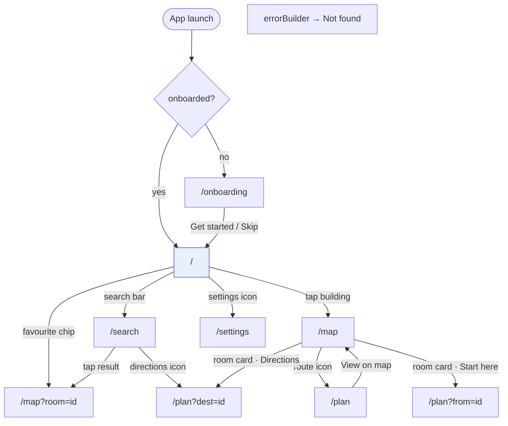

# UniNav — UI Screens & Navigation

> **Status:** describes the six screens that exist. Source: `app/lib/features/*/presentation/` and `app/lib/app/router/app_router.dart`.

Related: [Architecture](02-architecture.md) · [Map representation](05-map-representation.md) · [Search](09-search.md) · [Accessibility](10-accessibility.md)

---

## 1. Design language

Material 3, seeded from indigo `#3F51B5`, light and dark schemes generated by `ColorScheme.fromSeed`. Theme mode follows the user's preference (system / light / dark) and is persisted.

`MaterialApp.router` rebuilds only on theme change, via `ref.watch(appPrefsProvider.select((p) => p.themeMode))` — a `select` rather than a whole-object watch, so writing any other preference does not rebuild the entire app.

**There is no bottom navigation bar.** An earlier design proposed three tabs (Explore / Search / Profile). It was dropped because there is no Profile (no accounts), and Search is a *destination reached from Home*, not a peer of it. A persistent bar with one real tab is chrome, not navigation.

---

## 2. Route map

**The URL is the single source of truth.** Every screen is restorable from its route alone, which makes deep links work today and a web build possible later at no extra cost.

| Route | Screen | Query parameters |
|---|---|---|
| `/onboarding` | `OnboardingScreen` | — |
| `/` | `HomeScreen` | — |
| `/search` | `SearchScreen` | — |
| `/map` | `MapScreen` | `room` — select and jump to that room |
| `/plan` | `RoutePlannerScreen` | `dest`, `from` — prefill the dropdowns |
| `/settings` | `SettingsScreen` | — |

The onboarding redirect is bidirectional: an un-onboarded user is pushed to `/onboarding`, and an onboarded user who navigates there is pushed back to `/`. It reads `onboardedProvider` with `ref.read` inside the redirect, so the value is current per navigation without rebuilding the router itself.

### 2.1 `BackOrHomeButton`

Every screen's `AppBar` leading is a shared `BackOrHomeButton`: it pops when there is history and goes to `/` when there isn't.

This is not defensive over-engineering. A deep link like `/map?room=SJT813` lands on a screen with an **empty navigation stack**, where Flutter's default back arrow does not render at all — leaving the user with no way out. The shared widget makes that structurally impossible.

---

## 3. Screens

### 3.1 Onboarding

Two pages: *"Navigate inside buildings"* and *"Your route, your rules"* (step-free preference plus report-a-problem). `PageView`, dot indicators, a Skip button on every page, and completion persisted under `onboarded.v1`.

Two pages, not three, and fully skippable from the first frame. Onboarding should cost seconds, not attention — nothing is locked behind it and it is never shown again.

### 3.2 Home

Campus overview, and the app's answer to "what is here?"

- **Search launcher** — deliberately *not* a live `TextField`. It is an `InkWell` styled to look like one, carrying `Semantics(button: true)`, that pushes `/search`. A real field here would let users type into an input that discards their keystrokes, which is exactly the bug it replaced.
- **Favourites row** — horizontal `ActionChip`s straight to `/map?room=`. Hidden entirely when empty, so a new user sees zero clutter.
- **Building list, in two sections**:
  - *Mapped buildings* — navigable, with a chevron. `inProgress` buildings carry the caveat "Mapping in progress — some areas may be missing".
  - *Not mapped yet* — disabled, with a "Help map" action, under the note "These blocks exist but nobody has mapped them."

Navigable buildings sort first so an unmapped block never sits between two usable ones looking broken. Showing unmapped buildings at all is a deliberate product decision ([03 §2.1](03-data-model.md)): it distinguishes "not mapped" from "app is broken", and it is the strongest possible prompt to contribute.

### 3.3 Search

Full-screen, autofocused, debounced at **250 ms**.

- Query text persists across visits, restored in `initState` — returning from a result resumes where you were.
- Empty query shows **recents** (up to 8, most recent first, persisted), or a hint on first use.
- Each result: type icon, name, floor subtitle, and a **Directions** button that is disabled when the entry has no `nodeId`. Tapping the row opens the room on the map; tapping Directions goes to the planner.
- Zero results says *"Nothing found for 'x'. It may not be mapped yet."* — which is usually the truth, and more useful than a generic empty state.

Debouncing on write (not on read) means every downstream listener sees settled input. Details of ranking in [09-search.md](09-search.md).

### 3.4 Map

The most complex screen. Full rendering detail in [05-map-representation.md](05-map-representation.md).

| Element | Behaviour |
|---|---|
| Floor switcher | `SegmentedButton` over floors sorted by level |
| Route banner | Appears on `PlannerReady`: length, floor-change count, "Steps" action |
| Canvas | `InteractiveViewer` (unconstrained, scale 0.3–6) wrapping `CustomPaint` |
| Room card | Bottom card on selection: name, floor, aliases, tags, accessibility icon, favourite toggle |
| Room card actions | Directions · Start here · Nearest washroom · Report |

**Default floor resolution**, in priority order: explicit user choice → the route's start floor when a route exists → the lowest level. A newly computed route clears the manual override, so planning a route and tapping "View on map" lands on the right floor instead of wherever the user last browsed.

**"Nearest washroom" always reports its outcome** via snackbar — the distance, or *why* not ("No step-free route to a washroom from here"). A button that silently does nothing on failure is the worst kind of feedback, and this one used to.

### 3.5 Route planner

Two room dropdowns (rooms and POIs that have a `nodeId`), a mode `SegmentedButton`, and a Find route button.

Mode defaults to the user's saved preference, read in `initState` — the accessibility promise is *set once, applies everywhere*, not *choose again every time*.

Results render by exhaustive switch over the sealed `PlannerState`:

| State | UI |
|---|---|
| `PlannerIdle` | nothing |
| `PlannerComputing` | spinner |
| `PlannerReady` | summary (length · ~minutes · floor changes), "View on map", full step list with per-kind icons |
| `PlannerNoPath` | reason-specific message plus a Report action |
| `PlannerError` | error card |

The three `PlannerNoPath` messages are distinct on purpose:

- `noPathForConstraints` → "No step-free route exists between these rooms."
- `disconnected` → "These rooms are not connected on the map yet."
- `nodeMissing` → "One of these rooms is not routable yet."

Because `PlannerState` is sealed, the compiler rejects a build that forgets one of these. That is what keeps the distinctions from eroding over time.

**The step list is the primary accessibility surface for route content** ([10-accessibility.md](10-accessibility.md)). It is not a fallback for the map — a map is never the only representation.

### 3.6 Settings

The accessibility hub, reachable in two taps from home.

- **Appearance** — theme mode segmented control.
- **Routing** — default route mode radio group, with subtitles that state consequences: *"Never uses stairs; reports honestly when no step-free route exists."*
- **Data** — clear recent searches; queued-report count when the outbox is non-empty.
- **About** — version and a note that map data is community-maintained.

Every control writes through `appPrefsProvider`, which persists automatically as one versioned JSON blob (`prefs.v1`). Writes are fire-and-forget: a preference write must never block or crash the UI, and a corrupt blob falls back to defaults rather than bricking the app.

### 3.7 Report-a-problem sheet

A modal bottom sheet reachable from any room card, from a failed route, and from unmapped buildings on home. Category chips (wrong location, wrong name, missing room, bad route, accessibility issue, other), a 500-character message, submit.

**Offline-first:** the report is written to a local outbox and the user is told it succeeded, because from their point of view it did. Network is the app's problem, not theirs. `markDrained` exists for the future sync worker. This is the seed of the community pipeline ([06-community-mapping.md](06-community-mapping.md)) — zero-friction reporting is how a map finds out it is wrong.

### 3.8 Not-found page

`GoRouter.errorBuilder`. Icon, the offending URI, and a `BackOrHomeButton` that always works.

---

## 4. Cross-cutting patterns

**Async rendering.** Every async screen uses `AsyncValue.when(loading, error, data)` directly. There is no shared `AsyncView` wrapper — with six screens, the abstraction would cost more indirection than it saves.

**Provider mutation is never done during build.** Deep-link focus, camera centring and floor-override clearing all run in `WidgetsBinding.instance.addPostFrameCallback`, with a `mounted` check. Riverpod forbids mutating a provider mid-build, and listeners fire mid-build.

**Widgets stay dumb.** Screens read state and dispatch intents; logic lives in notifiers. The one exception is `RoutePlannerScreen`'s local form state (`_fromRoomId`, `_toRoomId`, `_prefs`), which is genuinely ephemeral and dies with the screen.

---

## 5. Not implemented

Screens from the original design that do not exist, and why:

| Screen | Status |
|---|---|
| Splash | Not needed — `main()` resolves prefs before `runApp`, so there is nothing to wait for |
| Auth / Profile | No accounts exist |
| Contribution form | Superseded for now by the report sheet ([06](06-community-mapping.md)) |
| Admin moderation | [07](07-admin-dashboard.md) |
| Offline banner | There is no online mode to lose |
| Active navigation screen | **Next deliverable** — needs the navigation engine ([18](18-navigation-runtime.md)) |

Also missing: reduced-motion gating on the route dash animation, and a high-contrast theme. Both are listed in [10-accessibility.md](10-accessibility.md).
