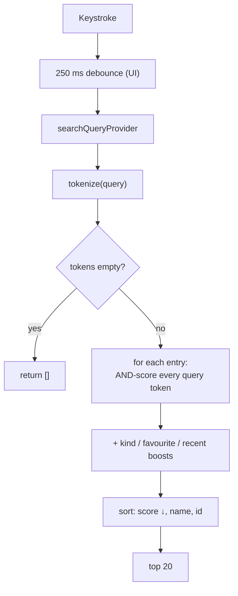

# UniNav — Search

> **Status:** implemented and tested. Source: `app/lib/domain/services/search/search_index.dart`, `app/lib/features/search/`.

Related: [Architecture](02-architecture.md) · [Data model](03-data-model.md) · [UI screens](08-ui-screens.md)

---

## 1. Where search runs: entirely on-device

The searchable corpus for a campus is small — on the order of 10⁴ entries, a few hundred KB. The index is built **in memory from the loaded bundle** and queried per keystroke.

Why not a server:

- A document database cannot do substring or fuzzy search at all.
- Per-keystroke network round-trips are slow, cost money, and are dead offline.
- At this scale, local search beats a network round-trip by orders of magnitude — a full scan of 10⁴ entries is well under a 16 ms frame budget.

Algolia and Typesense were rejected for the same reason: cost plus an offline hole, in exchange for no capability that cannot be afforded locally at this size.

The index is rebuilt once per bundle version (`searchIndexProvider` derives from `bundleProvider`), not per query. Seconds of app lifetime versus work on every keystroke.

---

## 2. Entry shape

```dart
final class SearchEntry {
  final String id;
  final SearchEntryKind kind;   // room | poi
  final String displayName;
  final String subtitle;        // floor name
  final String buildingId;
  final String floorId;
  final bool routable;          // has a nodeId
  final Set<String> tokens;
}
```

`routable` is surfaced in the UI: a room with no `nodeId` is findable and viewable but its Directions button is disabled. Making it a data field rather than a runtime lookup means the UI can never forget to check.

Sources of tokens:

| Entry | Tokenised from |
|---|---|
| Room | `name`, every alias, **every tag value** |
| POI | `name` (or the type name if unnamed) and the type name |

Tokenising tag *values* is what makes `{"person": "Dr. Rao"}` searchable by professor, and `{"dept": "Physics"}` searchable by department, with no separate directory. Tag *keys* are not indexed — searching "dept" should not match every tagged room.

---

## 3. Tokenisation

The same function runs at index time and at query time. That symmetry is not stylistic: if the two ever diverged, an entry could become permanently unfindable by a query that ought to match it exactly.

```dart
static Set<String> _tokenize(String text)
```

1. Lowercase.
2. Split on non-alphanumerics.
3. Split each part again at **letter↔digit boundaries**.
4. Keep the joined form when there was more than one part.

```
"SJT-513A"  → {sjt513a, sjt, 513, a}
"Lab 3"     → {lab3, lab, 3}
"8th Floor" → {8th, 8, th, floor}
```

Both `"sjt513"` and `"513"` therefore find the room — matching how people actually type a room number, which is unpredictably with or without separators.

---

## 4. Scoring

### 4.1 Per-token match

For each query token, the best match against the entry's token set:

| Match | Score |
|---|---|
| Exact | `100` |
| Prefix | `80 × (queryLen / tokenLen) + 10` |
| Fuzzy (query ≥ 3 chars) | `60 − 10 × editDistance` |
| Otherwise | `0` |

The prefix formula rewards **coverage**: `"phys"` against `"physics"` scores higher than `"phys"` against `"physiotherapy"`, because a longer match is stronger evidence of intent.

**Fuzzy matching is skipped for queries under 3 characters.** A one- or two-character typo is noise: at edit distance 1, `"ab"` matches an enormous fraction of the corpus and the results become useless.

### 4.2 AND semantics across tokens

```dart
for (final q in queryTokens) {
  final s = _bestTokenScore(q, entry.tokens);
  if (s == 0) { score = 0; break; }   // every query token must match something
  score += s;
}
```

`"physics lab"` requires **both** words to match. OR semantics would drown the intended result in every room containing "lab".

### 4.3 Ranking boosts

```
+10  entry is a room        (+5 for a POI)
+20  entry is a favourite
+15  entry is a recent pick
```

Rooms outrank POIs at equal text score because a room is the more specific answer. Favourites and recents **boost, never filter** — a favourite that does not match the query still does not appear. Personalisation should reorder results, not fabricate them.

### 4.4 Deterministic ordering

Sort by score descending, then display name, then id. Ties resolve identically on every run, so tests do not flake and the same query does not reshuffle its results between keystrokes.

---

## 5. Fuzzy matching: bounded Damerau–Levenshtein

```dart
static int _boundedEditDistance(String a, String b, int maxDist)  // -1 if beyond bound
```

**Damerau**, not plain Levenshtein — it counts a transposition as one edit, and transposition is the single most common typing error (`"lbary"` for `"library"`). Plain Levenshtein charges two, which is often enough to push a real typo out of range.

Three optimisations keep a worst-case keystroke trivially cheap across 10⁴ entries:

1. **Length pre-filter.** If lengths differ by more than `maxDist`, return immediately.
2. **Row-minimum early exit.** If every cell in a row already exceeds `maxDist`, no path back under the bound exists — abandon.
3. **Three rolling rows** instead of a full matrix. O(min(m, n)) memory. Three, not two, because the transposition rule reaches back two rows.

Bound: **1 edit for queries ≤ 5 characters, 2 for longer.** A short query has less signal, so a loose bound turns it into a wildcard.

---

## 6. Query pipeline



Unlike an earlier design, fuzzy matching is **not** gated behind "exact and prefix produced fewer than 5 hits". Every token runs the full ladder — exact, then prefix, then fuzzy — and takes its best result. Simpler, and at this corpus size the saving from gating is not measurable.

---

## 7. Recents

`RecentPicksNotifier`, persisted under `recents.v1`, capped at **8**.

```dart
typedef RecentPick = ({String id, String name, String subtitle});
```

The record carries display data rather than just an id, so the recents list renders without re-resolving ids against the index — which matters because the index may not have loaded yet when the empty-query state paints. A corrupt cache degrades to an empty list; recents are disposable and must never be fatal.

Eight, not fifty: recents are shown on an empty query, and a list long enough to scroll defeats its own purpose.

---

## 8. Not implemented

| Gap | Note |
|---|---|
| `building`, `department`, `person` entry kinds | Only `room` and `poi` exist. Professor and department search work *today* via tag-value tokenisation, without a separate kind |
| Same-building ranking boost | Meaningless while one building is loaded at a time |
| Zero-result logging | The highest-value mapping-gap signal there is — needs any telemetry at all ([07](07-admin-dashboard.md)) |
| Cross-building / campus-wide search | `SearchIndex.fromBundles` already takes a list; nothing passes more than one |
| Isolate execution | Unnecessary at current scale. Measure before moving |

---

## 9. Test coverage

`test/domain/search/search_index_test.dart`:

- Exact and prefix: room number, name word, alias, **tag value** (`person` → office), prefix, joined alphanumerics, multi-token AND
- Fuzzy: single-typo match; nonsense stays empty; 1–2 character queries never fuzz
- Ranking: rooms outrank POIs at equal text score; favourites and recents boost but never inject non-matches; deterministic tie order
- Empty and junk queries return nothing

`test/features/search/search_screen_test.dart` covers debounce, result rendering and the disabled-Directions state for non-routable entries.
