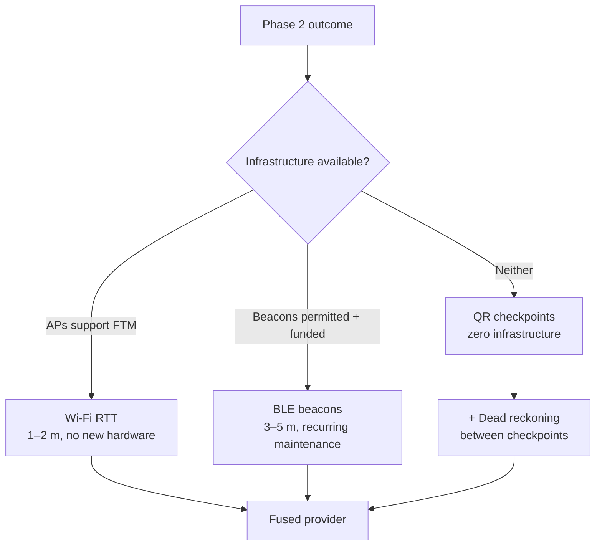

# UniNav — Roadmap

> **This roadmap replaces the original M1–M11 milestone plan.** That plan sequenced Firebase, contributions and an admin editor ahead of proving the core product. Building against it revealed that the actual open question is narrower and more urgent: *does graph-based multi-floor indoor routing work well enough on a real building to be worth scaling?*
>
> Everything is now organised around answering that question, demonstrating the answer, and only then choosing what to build next.

Related: [SRS](01-srs.md) · [Architecture](02-architecture.md) · [Navigation runtime](18-navigation-runtime.md) · [Known issues](15-known-issues.md) · [Mapping guide](16-mapping-guide.md) · [Feature backlog](13-feature-backlog.md)

---

## Where the project actually is

| Subsystem | State |
|---|---|
| Routing engine (A*, multi-floor, accessible modes, nearest-of-many) | **Complete and well tested** |
| Bundle schema + strict codec | **Complete** |
| Map renderer (pan/zoom, tap-select, route overlay, semantics) | **Complete** |
| On-device search (prefix, fuzzy, aliases, ranking) | **Complete** |
| App shell (routing, prefs, favourites, recents, onboarding, feedback outbox) | **Complete** |
| Mapping toolchain (browser tracer → bundle generator) | **Working; under-documented until this audit** |
| **SJT floor data** | **Floors 6 and 8 only.** `floor_0…5` and `floor_7` are empty files |
| Simulated navigation blob | **Not started** |
| Real indoor positioning | Research, not committed |
| Firebase / contributions / admin editor | Deferred indefinitely |

The engineering is ahead of the content. That is the honest summary, and it is what shapes Phase 1.

---

## Phase 1 — Complete the MVP

**Goal:** one building, fully mapped, fully routable, demonstrably working.

```mermaid
gantt
    title Phase 1
    dateFormat X
    axisFormat %s
    section Mapping
    Floor 5            :a1, 0, 1
    Floor 4            :a2, after a1, 1
    Floor 3            :a3, after a2, 1
    Floor 2            :a4, after a3, 1
    Floor 1            :a5, after a4, 1
    Ground Floor       :a6, after a5, 1
    section Engineering
    Graph generation   :b1, 0, 3
    Route visualization:b2, after b1, 2
    Simulated blob     :b3, after b2, 2
    section Demo
    MVP demo prep      :c1, after a6, 1
```

### 1.1 Mapping — the critical path

| Floor | Plan image | Traced source | In bundle |
|---|---|---|---|
| 8 | ✅ `8th floor.png` | ✅ `floor_8.json` | ⚠️ see below |
| 7 | ❌ | ❌ empty file | ❌ |
| 6 | ✅ `6th floor.png` | ✅ `floor_6.json` | ⚠️ see below |
| 5 | ✅ `5th floor.png` | ✅ `floor_5.json` | ❌ traced, never bundled |
| 4 | ✅ `4th floor.jpeg` | ❌ empty file | ❌ |
| 3 | ✅ `3rd floor.jpeg` | ❌ empty file | ❌ |
| 2 | ✅ `2nd floor.jpeg` | ❌ empty file | ❌ |
| 1 | ✅ `1st floor.jpeg` | ❌ empty file | ❌ |
| Ground | ❌ | ❌ empty file | ❌ |

> ⚠️ **`bundle_SJT.json` is currently empty** — a regeneration run with no input files overwrote it. Traced sources are intact; the tool has been fixed to refuse this. Regenerate before anything else: [15-known-issues.md §0](15-known-issues.md).

**Image acquisition is no longer the bottleneck — tracing is.** Seven of nine floors now have a plan image; only the Ground Floor and floor 7 lack one.

Target order — **5, 4, 3, 2, 1, Ground** — works downward toward the entrance. Floor 5 is already traced and only needs bundling. The Ground Floor matters disproportionately: it is where the building's `entrance` node must live, and the bundle has never had one.

Workflow per floor is in [16-mapping-guide.md](16-mapping-guide.md): trace in the browser tool, export `floor_N.json`, regenerate the bundle, open the app, walk a route you know.

**Definition of done for a floor**

- Every teaching room traced with a polygon and a doorway point.
- Every corridor centreline traced.
- Stairs and lifts named with the **same id used on every other floor they serve** — this is what creates vertical connectivity, and getting it wrong makes whole floors unreachable.
- Washrooms present as POIs so "nearest washroom" works.
- Bundle regenerates with no errors; warnings understood, not just ignored.

### 1.2 Finalise graph generation

- **Regenerate `bundle_SJT.json` from floors 5, 6 and 8 in one command** — it is currently empty ([15 §0](15-known-issues.md)). Do this first; nothing else can be demonstrated until it is done.
- **Run `NavGraph` validation inside `floorplan_to_bundle`.** The `.survey` generator does this and refuses to write a broken bundle; the tracer generator — the one actually in use — does not. The stricter check is on the unused pipeline. Fix that. ([15-known-issues.md](15-known-issues.md))
- **Get `flutter analyze` to zero and keep CI green.** It has never passed ([15 §2.5](15-known-issues.md)).
- **Add a reachability check.** Every room must be reachable from an entrance, mirroring `survey_to_bundle`.
- **Add an `entrance` node to the Ground Floor** and use it as the default route origin.
- **Remove the third copy of `assumedFloorHeightM`.** It is currently a literal inside `floorplan_to_bundle.dart`, defeating the single-source-of-truth fix already applied to the app.
- **Decide the fate of the `.survey` pipeline** — keep it as a documented no-plan-image alternative, or retire it. Two divergent generators is a maintenance liability.

### 1.3 Finish route visualisation

Largely done. Remaining:

- Travelled-versus-remaining route styling.
- Distance-to-next-turn on the active step.
- Gate decorative animation on `MediaQuery.disableAnimations`.

### 1.4 Simulated navigation blob

The one genuinely new subsystem in Phase 1. Full design in [18-navigation-runtime.md](18-navigation-runtime.md).

1. `UserPosition` / `PositionProvider` interfaces (pure domain).
2. `SimulatedPositionProvider` — interpolates along the route at 1.2 m/s.
3. `NavigationEngine` — projects position onto the route; emits progress, current step, active floor.
4. Blob rendering plus a **visible "Simulated" label** — non-negotiable ([18 §4.2](18-navigation-runtime.md)).
5. Active-navigation UI: step card, automatic floor switching, arrival state.

Steps 1–3 are pure Dart and testable before any UI exists.

### 1.5 Prepare the demo

- A scripted route that crosses at least two floors and uses a lift.
- Step-free mode shown side by side with fastest, on the same pair of rooms.
- "Nearest washroom" from an arbitrary room.
- A deliberate failure case, to show the app reports *why* rather than shrugging.
- A fallback recording, in case of device trouble on the day.

**Phase 1 exit criteria:** six floors mapped and routable; bundle regenerates clean; blob follows a multi-floor route end to end; demo rehearsed.

---

## Phase 2 — Present the MVP to the HOD

**Goal:** institutional feedback and, if the work merits it, approval to scale.

Phase 2 is not a code phase. Its output is a decision.

### What to demonstrate

1. **Indoor routing** — search a room, get a path, see it drawn on the real floor plan.
2. **Multi-floor navigation** — a route that changes floors, with the map following automatically and the instruction naming the lift or stairs.
3. **Simulated navigation** — the blob walking the path, **labelled as simulated**.
4. **Accessible routing** — step-free mode producing a different, longer, lift-only route; and an honest "no step-free route exists" where none does.

### What to say plainly

- The map is built from traced floor plans plus paced distances, by one person, with a tool built for the purpose.
- **Positioning is simulated.** The architecture is built to accept real positioning without a rewrite ([18-navigation-runtime.md](18-navigation-runtime.md)), but that work has not been done and would need evaluation.
- Adding a new building is a data task, not a development task.

Claiming working localisation would be the one thing that could turn a strong demo into a credibility problem. Say it is simulated, and say why that was the right sequencing decision.

### What to ask for

| Ask | Why it matters |
|---|---|
| Approval to map further buildings | Mapping is the bottleneck; permission and access are institutional |
| **Whether campus Wi-Fi APs support 802.11mc (FTM)** | A single yes/no that determines whether Wi-Fi RTT is a leading candidate or a non-starter ([18 §5.3](18-navigation-runtime.md)) |
| Whether BLE beacons could be mounted | Determines if beacons are even discussable |
| Access to official floor plans | Faster and more accurate than tracing photographs |
| Student mappers | Mapping parallelises; engineering does not |
| Whether this can be a formal project | Changes the time budget entirely |

### Scaling discussion

Roughly 8 floors × 10 buildings, at 30–45 minutes per floor to trace once a plan image exists. That is tractable for a small team over a term and intractable for one person. Establishing that arithmetic honestly is the real purpose of the conversation.

**Phase 2 exit criteria:** demo delivered; feedback recorded; a documented answer on infrastructure and mapping support.

---

## Phase 3 — Research-assisted indoor positioning

> **Research directions, not a committed plan.** Sequencing depends entirely on Phase 2's answers. Detailed evaluation in [18-navigation-runtime.md §5](18-navigation-runtime.md).

**Recommended first step regardless of the answer: QR checkpoints.** Zero infrastructure, deployable this semester, and it solves the MVP's actual weakness — "where am I starting from?" — without needing to solve continuous tracking at all.

**Highest research value: graph-constrained dead reckoning.** UniNav already has the corridor graph. Snapping PDR output onto graph edges should bound drift substantially compared with unconstrained PDR, and that is a measurable, publishable claim rather than a feature.

**Success criterion for any of these:** the Position Provider swap is a one-line provider override, and nothing in the routing engine, the renderer or the navigation engine changes. If a candidate approach cannot satisfy that, the architecture is wrong and should be fixed before the approach is adopted.

---

## Deferred indefinitely

Not cancelled — correctly sequenced behind proving the core.

| Deferred | Why |
|---|---|
| Firebase (auth, remote bundles, sync) | Every touchpoint already sits behind a repository interface or the offline outbox. Additive whenever it is wanted. |
| Community contributions + moderation | Meaningless before there is a map worth correcting. Design preserved in [06-community-mapping.md](06-community-mapping.md). |
| Admin dashboard + floor editor | The browser tracer covers authoring at current scale. Design preserved in [07-admin-dashboard.md](07-admin-dashboard.md). |
| Multi-campus, multi-building routing | The graph layer supports it; no second building is mapped yet. |
| Voice guidance, i18n, AR | [13-feature-backlog.md](13-feature-backlog.md). |

---

## Sequencing rationale

**Content before infrastructure.** The routing engine is done and tested; the map is 2 floors of 9. Building Firebase now would add capability the project cannot yet use, on top of a map nobody can navigate.

**Simulation before sensing.** Simulation validates layers 1, 3 and 4 end to end, builds the whole consumer side of the position interface, and is the honest thing to demo. Real positioning is a research project with an infrastructure dependency that Phase 2 exists to resolve.

**A demo before a decision.** Scaling to a campus needs institutional buy-in. Working software is the argument; a roadmap is not.

**Kill criteria.** If Phase 1 mapping proves impractically slow per floor, the answer is better tooling — semi-automatic room extraction from plan images — not more grinding. If Phase 2 yields no institutional support, the honest scope is one excellent building rather than a thin campus.
