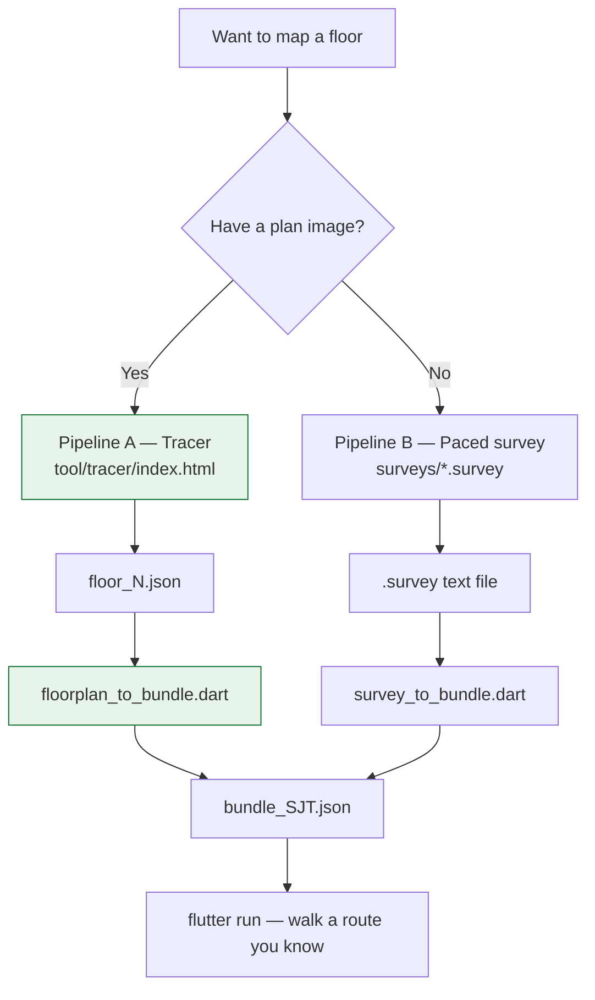
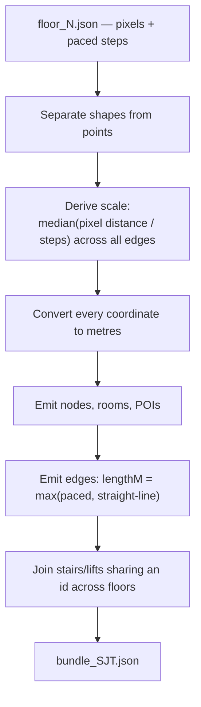

# UniNav — Mapping Guide

How to turn a real building into a working map.

There are **two pipelines**. Which one you use depends on a single question: *do you have a floor plan image?*



**Pipeline A is the one in production.** Every shipped SJT floor came through it. Pipeline B is the fallback for buildings with no plan, and is currently unused.

Related: [Field sheet](17-field-sheet.md) · [Data model](03-data-model.md) · [Routing engine](04-routing-engine.md) · [Roadmap](14-roadmap.md) · [Known issues](15-known-issues.md)

---

## What you are actually producing

Not a beautiful floor plan. A **graph**, plus enough geometry to make it legible:

| Thing | Purpose | Precision needed |
|---|---|---|
| **Nodes** at doorways and junctions | The only things routing connects | Position matters; a metre is fine |
| **Edges** with distances | What A* costs | **This is the one number that must be right** |
| **Room polygons** | Drawing only | Approximate is fine |
| **Corridor centrelines** | Drawing only | Approximate is fine |
| **Shared stair/lift ids** | Vertical connectivity | **Must match exactly across floors** |

The two bolded rows are where mapping goes wrong. Everything else tolerates error gracefully.

---

# Pipeline A — Tracing a plan image

## A1. Get the plan image

A photograph of the fire-evacuation plan is enough. Shoot it square-on, well lit, whole plan in frame. Save it as `app/assets/campuses/maps/<building>/<N>th floor.png`.

## A2. Open the tracer

```
app/tool/tracer/index.html
```

Open it in a browser. No install, no server, no build step, no dependencies. It exists because room shapes were previously estimated by eye from a photo, and everything downstream inherited that error. Tracing replaces guessing with clicking.

## A3. Three things you trace

| Mode | Action | Produces |
|---|---|---|
| **Room (polygon)** | Click each corner of the room | The outline — what the room *looks like* |
| **Node (click)** | Click the doorway — where you actually walk in | The graph point — what routing *connects* |
| **Corridor (click…)** | Click along the corridor centreline, `Enter` to finish | The drawn corridor shape |

**Fill in ID, display name, aliases and kind *before* tracing** — the tracer attaches whatever is in those fields to the next shape you draw.

### The shape/point model

A feature is two separable things:

- A **shape** — the polygon plus the semantics (`kind`, `displayName`, `aliases`). It says *what and where* the room is.
- One or more **points** — the doorway coordinates. Points are the only things the routing graph connects.

A point links to its shape by `ref: <shapeId>`, or implicitly by sharing the shape's id. One shape may own several points — a lift junction with a lift-side and a stair-side entry — which the generator then joins with short `door` edges so the junction reads as one connected place.

Why separate: a room's *centre* is where the label goes, and its *doorway* is where you walk. Merging them puts route endpoints inside walls.

### Corridors are drawing-only

Traced corridors do not change routing at all. Routing uses graph edges and their paced weights. This is deliberate: a graph edge says "A to B in 25 steps" and says nothing about the corridor bending twice on the way. Drawn literally, that becomes a straight line cutting diagonally through the building.

Only the **centreline** is traced. Set the corridor-width slider to the real width and the renderer strokes it to a walkable area — half the clicks of outlining both walls, with corner joins correct automatically.

## A4. Set the kind correctly

The `kind` drives everything downstream:

| Kind | Becomes a Room? | Becomes a POI? | Graph node kind |
|---|---|---|---|
| `classroom` `lab` `office` `library` `cafeteria` | ✅ | — | room |
| `room` `radio_station` | ✅ (`other`) | — | room |
| `gallery` | ✅ (`auditorium`) | — | room |
| `toilet_male` / `toilet_female` | ✅ (`washroom`) | ✅ (`washroom`) | room |
| `water_cooler` `printer` | — | ✅ | room |
| `lift_junction` | ✅ (`junction`) | — | `junction` |
| `lift` | — | — | `elevator` |
| `staircase` | — | — | `stair` |
| `entrance` / `exit` | — | — | `entrance` / `exit` |

`toilet_male` and `toilet_female` become both a Room and a POI. That is what makes **"nearest washroom"** work — the POI carries the routable node, the Room carries the outline.

## A5. Edges — the manual step

> **The tracer does not create edges.** `build()` emits `edges: meta?.edges || []`, so edges come only from a previously loaded file.

To author edges for a new floor, either:

1. Load an existing `floor_N.json`, trace on top of it, and keep its edges; or
2. Write the `edges` array by hand into the exported JSON.

```jsonc
{"from": "S1", "to": "SJT808", "weight": 15.3}
```

`weight` is in **paced steps**, not metres. Pace the corridor between the two points and write the count. This is the number the whole route quality rests on.

> This is the roughest edge of the toolchain, and a known gap ([15-known-issues.md](15-known-issues.md)).

## A6. Export and generate

Download from the tracer as `floor_N.json`, save it beside the plan image, then:

```bash
cd app
dart run tool/survey/floorplan_to_bundle.dart \
    assets/campuses/maps/sjt/floor_6.json \
    assets/campuses/maps/sjt/floor_8.json \
    --out assets/campuses/vit-vellore/bundle_SJT.json \
    --stride 0.75
```

**Pass every floor of the building in one command.** Vertical connections are created by matching stair/lift ids *across the floor documents given*. Regenerate one floor alone and you get a bundle with no vertical links at all.

`--stride` is your metres-per-pace (default 0.75). It scales every edge identically, so it affects the displayed "45 m" figure but not which route is chosen.

## A7. What the generator does



**Deriving the scale is the clever part.** Node coordinates are in *plan pixels*; edge weights are in *paced steps*. Those are different units, and A* needs both in one unit — its heuristic compares straight-line coordinate distance against accumulated edge cost, so feeding it pixels-versus-steps makes the heuristic meaningless.

Rather than making you measure in metres, the tool **fits pixels-per-step from the data itself** and takes the **median** across all edges. The median ignores the handful of edges where pacing or a traced dot was off; a mean would let one bad edge distort the whole floor.

**Length clamping.** Every edge is written as `max(paced, straight-line)`, because A*'s heuristic is only admissible while each edge is at least as long as the straight line between its endpoints ([04 §3.2](04-routing-engine.md)). Where the two disagree by more than 5%, you get a warning naming both numbers — usually meaning a miscount or a misplaced dot.

**Node ids are scoped by floor** (`n_f8_S1`), because two floors traced independently often reuse short ids — every floor's lift may be called `L1`. Without the prefix those collide into one node.

## A8. Read the warnings

```
warning: floor 8: derived scale 13.3 px/step (0.056 m/px, stride 0.75m)
```
Sanity check: a plausible corridor length in metres.

```
warning: edge S1->SJT808: paced 11.5m but plan geometry says 14.2m — using the larger
```
Miscounted paces, or a dot in the wrong place. Small gaps are normal; large ones are a real error.

```
warning: "L1" appears on only one surveyed floor — it connects nothing
```
**Fix this one.** Either the id differs between floors, or you passed only one floor to the command.

```
warning: vertical "L1" f6->f8: the two floors' traced positions put it 12.1m apart
```
The two floors were traced from images with different alignment. Routing still works; the geometry is inconsistent.

---

# Pipeline B — Paced survey, no plan image

For a building with no obtainable plan. Written for one person with a notebook and an hour. Carry [17-field-sheet.md](17-field-sheet.md).

## B1. Calibrate your pace, once

Find a known distance — a tile grid, a court line — and count paces over 10 m. Most adults land at 0.70–0.80 m per pace. Write your number at the top of your notes. Everything else depends on it.

## B2. Do one floor first

Not the building — one floor. Finish it end to end, generate the bundle, open it in the app. You will learn more from that loop than from surveying four floors blind.

## B3. Record three things per floor

1. **Corridor shape** — a straight run, an L, a loop, or several connected runs.
2. **Distances along each corridor** where something is.
3. **Which side** each thing is on as you walk.

```
c_main (entrance -> far end)
   0   entrance
   8   L   SJT 101   classroom
   8   R   SJT 102   classroom
  15   R   washroom
  30   R   STAIRS  (call it st_main)
  34   R   LIFT    (call it lift_main)
  45   L   SJT 103   lab, Physics dept
  60   end
```

**Rules that save you a second trip**

- **Name stairs and lifts, and use the same name on every floor they serve.** `st_main` on the ground floor and `st_main` on the first floor is what tells the app they are the same staircase. Get this wrong and whole floors become unreachable.
- **Note which floors each staircase actually reaches.** Some stop at the 3rd. This matters more than room accuracy.
- **Note whether the lift is genuinely usable** — staff-only, card-access or permanently broken changes step-free routing for real wheelchair users.
- Round to the metre. ±1 m does not affect routing quality.
- If a corridor turns, start a new corridor at the turn and `link` them.
- Do not chase perfect room shapes. Position along the corridor is what matters.

## B4. Type it up

Copy `app/surveys/SJT.survey` as your template. The format mirrors field notes almost line for line:

```
building SJT "Silver Jubilee Tower" alias=SJT,Tower

floor f0 level=0 "Ground Floor"
corridor c_main length=60 heading=E

entrance 0 L e_main
room 8 L SJT101 "SJT 101" classroom alias=101
room 8 R SJT102 "SJT 102" classroom alias=102
poi 15 R washroom
stair 30 R st_main
lift 34 R lift_main
room 45 L SJT103 "SJT 103" lab alias=103 tag:dept=Physics
```

Corridors accept either form:

```
corridor c_main length=60 heading=E [start=0,20]   # easier from field notes
corridor c_main from=0,20 to=60,20                 # explicit endpoints
```

L-shaped floor — two corridors and a link:

```
corridor c_main from=0,20  to=60,20
room 8 L SJT101 "SJT 101" classroom
corridor c_wing from=60,20 to=60,60
room 12 L SJT120 "SJT 120" classroom
link c_main 60 c_wing 0
```

> A bespoke line format rather than YAML or JSON, because this file is typed from paper notes, often on a laptop in a corridor. Every character of syntax is friction, and a mis-indented YAML block is a far worse failure than a malformed line the parser can point at by number. Errors read `line 42: <what was wrong>`, and parsing continues — one bad line does not hide the other nineteen.

## B5. Generate

```bash
cd app
dart run tool/survey/survey_to_bundle.dart surveys/SJT.survey
```

This generator does three jobs beyond format conversion, and **refuses to write a broken bundle**:

- `room "SJT 305" is not reachable from e_main` — that floor has no working stair or lift link. Usually a typo in a shared stair id.
- `SJT101 at 75 m is outside corridor c_main (0..60 m)` — a distance longer than its corridor.
- `"st_main" appears on only one floor` — you named a staircase but recorded it once.

Fix, re-run, repeat.

---

## Verifying either pipeline

```bash
cd app
flutter test
flutter run
```

Then **walk a route you know**. Pick two rooms you can navigate between with your eyes closed, plan the route, and compare.

| Symptom | Almost certainly |
|---|---|
| Route goes the long way round | A missing edge, or a corridor link never authored |
| "These rooms are not connected on the map yet" | A stair/lift id differs between floors |
| Distance obviously wrong | A miscounted pace weight, or the wrong `--stride` |
| Room in the wrong place on screen | A misplaced traced polygon. Enable the debug grid ([05 §4.5](05-map-representation.md)) and read the coordinates off the screen |
| Straight lines cutting through walls | Corridors not traced — the renderer fell back to drawing graph edges |
| Route skips a floor in the instructions | That floor genuinely isn't in the bundle |

**If the route looks wrong, the graph is wrong, and the app is telling you something true about your data.**

---

## How long it takes

| Task | Time |
|---|---|
| Tracing a floor from a plan (Pipeline A) | 30–45 min |
| Authoring edge weights for that floor | 20–30 min, plus a walk to pace it |
| Walking + noting a floor (Pipeline B) | 20–30 min per ~20-room corridor |
| Typing up a survey floor | ~15 min |

Your first floor takes twice as long as your second.

---

## Known rough edges

| Issue | Impact |
|---|---|
| The tracer does not author edges (§A5) | Manual JSON editing per floor — the biggest friction point |
| `floorplan_to_bundle` does **not** run `NavGraph` validation | The pipeline in use is the *less* strict one. It can emit a bundle the app rejects |
| No reachability check in Pipeline A | An unreachable room ships silently |
| Two divergent generators | Format drift risk; consolidation is a Phase 1 task |

All tracked in [15-known-issues.md](15-known-issues.md).

---

## What to skip for now

Furniture, exact door widths, anything outdoors, and any building that is not the one you are finishing. Get one building genuinely correct, then decide whether the format survived contact with reality before scaling up.
