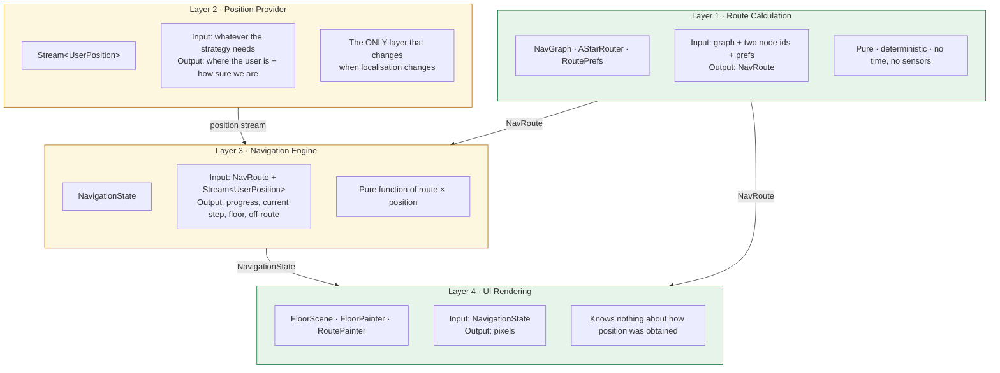
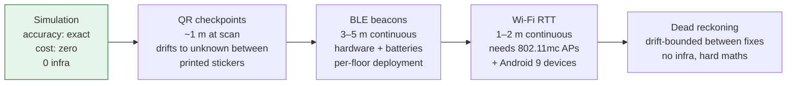

# UniNav — Navigation Runtime: Position, Simulation & the Path to Real Localisation

> **Status: DESIGN. None of the Position Provider or Navigation Engine code described here exists yet.**
> What ships today is route *calculation* and route *rendering*. The animated marker that follows a route — the "navigation blob" — is the next piece of work, and it will be **simulated**, not sensed.
> This document exists so that when real indoor positioning arrives, nothing above the Position Provider has to change.

Related: [Architecture §5](02-architecture.md) · [Routing engine](04-routing-engine.md) · [Map representation](05-map-representation.md) · [Roadmap](14-roadmap.md) · [Feature backlog](13-feature-backlog.md)

---

## 1. The problem this design solves

UniNav computes an excellent route. It cannot tell you where you are standing.

That is not an oversight — **indoor positioning is a genuinely hard, hardware-dependent, unsolved-in-general problem.** GPS does not work indoors. Every alternative (QR, BLE, Wi-Fi RTT, dead reckoning) has different accuracy, different hardware requirements, different infrastructure cost, and different failure modes. Picking one now, before any has been tested on this campus, would be a guess.

The naive way to build navigation is to let the map screen ask a positioning SDK where the user is. Do that, and every change of positioning strategy rewrites the map screen. Given that the strategy is *expected* to change at least three times, that is the wrong shape.

So the runtime is designed around one question: **what is the smallest interface that every positioning approach can satisfy?**

Answer: a stream of positions. Everything else follows.

---

## 2. The four layers



Green = shipped. Amber = designed, not built.

### Why exactly these four

| Layer | Single responsibility | Reason for the boundary |
|---|---|---|
| Route Calculation | Path through a graph | Timeless and stateless. Testable with no clock, no sensors, no widgets. Already the best-tested code in the project. |
| Position Provider | Where the user is | The *only* volatile concern. Isolating it is the entire point of the design. |
| Navigation Engine | Progress along a route | Route × position → state is pure geometry. It should be VM-testable with a scripted position stream, no device required. |
| UI Rendering | Drawing | Already isolated and already stateless with respect to data. |

If layers 2 and 3 were merged, swapping a positioning strategy would drag progress-tracking and off-route logic with it. If layers 3 and 4 were merged, testing progress tracking would need a widget harness and a real device.

---

## 3. Proposed interfaces

> Not yet in the codebase. Written here so the shape is agreed before implementation.

### 3.1 The position contract

```dart
/// Where the user is, and how much to trust it.
/// Lives in domain/entities — pure, no Flutter.
final class UserPosition {
  const UserPosition({
    required this.floorId,
    required this.point,          // metres, floor-local frame (same as everything else)
    required this.accuracyM,      // 68% confidence radius
    required this.source,
    this.headingDeg,              // optional; null when unknown
    required this.timestamp,
  });

  final String floorId;
  final Point2 point;
  final double accuracyM;
  final PositionSource source;
  final double? headingDeg;
  final DateTime timestamp;
}

enum PositionSource { simulated, qrCheckpoint, beacon, wifiRtt, deadReckoning, manual }
```

```dart
abstract interface class PositionProvider {
  /// Positions as they become available. May be sparse (QR) or continuous (BLE).
  Stream<UserPosition> get positions;

  /// Last known position, or null if never fixed.
  UserPosition? get current;

  Future<void> start();
  Future<void> stop();
}
```

Three fields carry deliberate weight:

- **`accuracyM`** is mandatory, not optional. A QR scan is accurate to ~1 m; dead reckoning drifts to 10 m within a minute. The UI must be able to render that difference (a tight dot versus a wide halo) or it will imply a precision the system does not have. Systems that hide uncertainty teach users to trust them wrongly.
- **`source`** is carried through so the UI can be honest — *"Simulated"* and *"Last seen at the lift 40 s ago"* are different messages, and the user deserves the right one.
- **`floorId`** is explicit rather than inferred from coordinates, because floors share an x/y frame by design ([03-data-model.md](03-data-model.md)) and `(x, y)` alone is genuinely ambiguous.

### 3.2 The navigation state

```dart
final class NavigationState {
  final NavRoute route;
  final UserPosition? position;

  final int segmentIndex;          // which RouteSegment the user is on
  final double distanceAlongM;     // metres travelled along the route
  final double remainingM;
  final int remainingSeconds;

  final int currentInstructionIndex;
  final String activeFloorId;      // what the map should be showing
  final bool offRoute;
  final double deviationM;
}
```

```dart
abstract interface class NavigationEngine {
  Stream<NavigationState> get state;
  void startNavigation(NavRoute route);
  void stopNavigation();
}
```

The engine's core is a **projection**: snap the raw position onto the route polyline (`PolygonUtils.distanceToSegment` already does the maths), and the arc-length of that projection is progress. `offRoute` is simply deviation exceeding a threshold scaled by `accuracyM` — an inaccurate fix must not be allowed to declare the user lost.

---

## 4. Phase 1: the simulated navigation blob

**This is the immediate deliverable.**

```dart
final class SimulatedPositionProvider implements PositionProvider {
  SimulatedPositionProvider({
    required NavRoute route,
    this.speedMps = 1.2,          // matches AStarRouter.walkingSpeedMps
    this.tickInterval = const Duration(milliseconds: 33),  // ~30 fps
  });
  // Walks a cursor along the route polyline at constant speed.
  // Emits UserPosition(source: simulated, accuracyM: 0).
  // Crosses floor boundaries by switching floorId at segment ends.
}
```

Rendering: a `BlobPainter` (or an addition to `RoutePainter`) draws a filled circle with a soft outer ring, plus a heading indicator derived from the direction of travel. The route behind it dims to "travelled"; the route ahead stays bright.

### 4.1 Why simulation is legitimate, not a fake

This deserves to be stated plainly, because "the blob is simulated" can sound like an admission of failure. It is not:

1. **It validates the other three layers end to end.** If the blob follows the path correctly, then route calculation, segmentation, floor transitions, instruction sequencing and rendering are all provably correct together. That is real integration evidence about real code.
2. **It builds the entire consumer side of the interface.** When a QR provider is written later, layers 3 and 4 are already complete and already tested. The remaining work is genuinely only layer 2.
3. **It is the right demo artefact.** For [Phase 2](14-roadmap.md) — presenting to the HOD — the question being answered is *"does multi-floor indoor routing work on this campus?"*, not *"can we localise a phone?"* A simulation answers the first question honestly and defers the second.
4. **The alternative is worse.** Shipping a half-working real positioning system would demo badly *and* teach nothing about routing quality, because every failure would be ambiguous between the two subsystems.

### 4.2 The one rule

**The simulation must always be labelled as simulated in the UI.** A visible "Simulated navigation" chip, and `PositionSource.simulated` carried in the data. A demo that lets a viewer believe the phone knows where it is has misled them, and that is not a trade worth making for a nicer screenshot.

---

## 5. Phase 3: real positioning — research directions

> **These are research directions, not planned features.** None is committed. Each needs evaluation on this campus before anything is chosen. Documented here so the evaluation criteria are agreed in advance rather than argued about afterwards.



### 5.1 QR checkpoints — the recommended first real step

Printed codes at lifts, stairwells and corridor junctions, each encoding a `nodeId`. Scanning gives an exact fix at a known graph node.

| | |
|---|---|
| **Accuracy** | Exact at scan; unknown afterwards |
| **Infrastructure** | Printed stickers. Effectively free. |
| **Effort** | Low — a camera plugin plus a `nodeId` lookup |
| **Failure mode** | Benign: no scan means no fix, and the app can say so |
| **Why first** | It is the only approach that can be *deployed and tested this semester*. It also directly solves the MVP's real weakness — "where am I starting from?" — without solving continuous tracking at all. |

The honest limitation: it gives *checkpoints*, not tracking. Between scans the position is stale. Combined with dead reckoning (§5.4) that becomes a genuinely usable system; alone it is a much better "set your start point" than a dropdown.

### 5.2 BLE beacons

Battery-powered transmitters; position from RSSI trilateration or fingerprinting.

| | |
|---|---|
| **Accuracy** | 3–5 m typical; worse through walls and crowds |
| **Infrastructure** | Real hardware, real money, battery replacement, institutional permission to mount devices |
| **Effort** | High — RSSI is extremely noisy; needs filtering (Kalman or particle) and a site survey |
| **Blocker** | Requires institutional buy-in. This is precisely what [Phase 2](14-roadmap.md) exists to obtain. |

### 5.3 Wi-Fi RTT (802.11mc / FTM)

Round-trip time-of-flight to APs. Android `WifiRttManager`.

| | |
|---|---|
| **Accuracy** | 1–2 m — the best of the infrastructure-based options |
| **Infrastructure** | Requires 802.11mc-capable APs *already deployed*, and their locations |
| **Effort** | Medium if the APs qualify; impossible if they don't |
| **First question** | Do the campus APs support FTM? That single fact determines whether this is a leading candidate or a non-starter — establish it before any other work. |
| **Caveat** | Android-only, API 28+. iOS has no equivalent public API. |

### 5.4 Dead reckoning (pedestrian dead reckoning, PDR)

Step detection from the accelerometer plus heading from magnetometer/gyroscope, integrating position from a known start.

| | |
|---|---|
| **Accuracy** | Good for ~30 s; drifts without bound after |
| **Infrastructure** | None — it is the only zero-infrastructure continuous option |
| **Effort** | High. Step detection is tractable; **indoor magnetometer heading is badly corrupted by steel and electrical noise**, which is the real difficulty. |
| **Best use** | Not standalone. As the *interpolator between* QR or BLE fixes, with each fix resetting accumulated drift. |
| **Research value** | Highest of the four — genuine signal-processing work, and a legitimate paper-shaped contribution if a graph-constrained variant (snap PDR output to corridor edges, which UniNav already has) measurably outperforms unconstrained PDR. |

### 5.5 Evaluation criteria — agreed in advance

Whatever is chosen must be judged on all five, not just accuracy:

1. **Accuracy under realistic conditions** — crowded corridor, phone in pocket, not a quiet empty lab.
2. **Time-to-first-fix.** A system that needs 30 s to locate you is useless for a two-minute walk.
3. **Failure behaviour.** Does it degrade honestly, or does it confidently report a wrong position? The second is far worse than the first.
4. **Deployment cost**, including permission to install anything physical.
5. **Maintenance load** on a solo maintainer — beacon batteries are a recurring obligation, not a one-off.

---

## 6. What must not change when positioning changes

The contract this whole document exists to protect:

| Component | Changes when positioning strategy changes? |
|---|---|
| `NavGraph`, `AStarRouter`, `RoutePrefs` | **No** |
| Bundle schema and codec | **No** |
| `NavigationEngine` | **No** — it consumes `Stream<UserPosition>`, not a sensor |
| `FloorScene`, `FloorPainter`, `RoutePainter`, `MapScreen` | **No** — they consume `NavigationState` |
| `PositionProvider` implementation | **Yes — and only this** |
| A new dependency in `pubspec.yaml` | Yes |
| A provider override binding the chosen implementation | Yes |

Riverpod makes the swap a one-line change at the composition root, exactly as `keyValueStoreProvider` is overridden in `main()` today:

```dart
final positionProviderProvider = Provider<PositionProvider>(
  (ref) => SimulatedPositionProvider(route: /* … */),   // ← the only line that changes
);
```

Mixed strategies fit the same shape — a `FusedPositionProvider` taking QR fixes and dead-reckoning between them is itself just a `PositionProvider`, and nothing downstream can tell.

---

## 7. Implementation order

1. `UserPosition`, `PositionSource`, `PositionProvider` in `domain/entities` and `domain/services/positioning`.
2. `SimulatedPositionProvider` — pure Dart, VM-testable with a fake clock.
3. `NavigationEngine` — projection onto the route polyline, progress, current instruction, active floor. VM-testable with a scripted position stream.
4. `navigationStateProvider` wiring engine to planner output.
5. Blob rendering + travelled/remaining route styling + the "Simulated" label.
6. An active-navigation UI: current step card, auto floor switching, arrival state.

Steps 1–3 are pure domain work and carry no Flutter dependency, so they are testable before any UI exists — which is the same discipline that made the routing engine the most reliable part of the project.
