# UniNav Documentation

Indoor navigation for large campuses. Google Maps stops at the door; UniNav takes over inside.

**Venue knowledge lives entirely in data, never in code** — so one binary serves a university, a mall, a hospital or an airport, and onboarding a new venue is a data task rather than a development task.

---

## Start here

| If you are… | Read, in this order |
|---|---|
| **A faculty reviewer** | [01 SRS](01-srs.md) → [14 Roadmap](14-roadmap.md) → [04 Routing engine](04-routing-engine.md) |
| **An internship recruiter** | [02 Architecture](02-architecture.md) → [04 Routing engine](04-routing-engine.md) → [15 Known issues](15-known-issues.md) |
| **A new contributor (code)** | [02 Architecture](02-architecture.md) → [03 Data model](03-data-model.md) → [15 Known issues](15-known-issues.md) |
| **A new contributor (mapping)** | [16 Mapping guide](16-mapping-guide.md) → [17 Field sheet](17-field-sheet.md) |
| **Curious what actually works** | [The honest summary](#the-honest-summary) below |

---

## The document set

### Product

| # | Document | What it covers |
|---|---|---|
| 01 | [SRS](01-srs.md) | Problem, personas, requirements, **MVP scope**, risks. Every requirement marked shipped or not |
| 13 | [Feature backlog](13-feature-backlog.md) | Idea register — delivered, deferred, candidate, research |
| 14 | [Roadmap](14-roadmap.md) | **Phase 1 → 2 → 3.** Replaces the old M1–M11 milestone plan |
| 15 | [Known issues](15-known-issues.md) | Honest register of gaps, technical debt and unverified claims |

### Architecture & engineering

| # | Document | What it covers |
|---|---|---|
| 02 | [Architecture](02-architecture.md) | Layering, DI, error handling, offline tiers, **the four-layer navigation separation** |
| 03 | [Data model](03-data-model.md) | Campus file, **bundle JSON schema**, codec rules, current data inventory |
| 04 | [Routing engine](04-routing-engine.md) | Graph model, weights, **A\* with self-disabling heuristic**, instructions |
| 05 | [Map representation](05-map-representation.md) | Format decision, `FloorScene`, painters, interaction, theming |
| 09 | [Search](09-search.md) | Tokenisation, scoring, bounded Damerau–Levenshtein, ranking |
| 11 | [Performance & scale](11-performance.md) | Shipped optimisations, deferred strategies **with explicit triggers** |
| 18 | [Navigation runtime](18-navigation-runtime.md) | **Position Provider design, simulated blob, indoor-positioning research** |

### Experience

| # | Document | What it covers |
|---|---|---|
| 08 | [UI screens](08-ui-screens.md) | The six screens, route map, cross-cutting patterns |
| 10 | [Accessibility](10-accessibility.md) | Data → routing → UI. Step-free routing, canvas semantics, gaps |

### Mapping

| # | Document | What it covers |
|---|---|---|
| 16 | [Mapping guide](16-mapping-guide.md) | **Both pipelines** — tracer (in use) and paced survey (fallback) |
| 17 | [Field sheet](17-field-sheet.md) | Printable survey sheet |

### Deferred designs

Preserved because the reasoning still shapes decisions already made. Each carries a status banner.

| # | Document | Status |
|---|---|---|
| 06 | [Community mapping](06-community-mapping.md) | Design only — a local report outbox is the seed |
| 07 | [Admin dashboard](07-admin-dashboard.md) | Design only — the browser tracer substitutes |
| 12 | [Security](12-security.md) | Rules written, never deployed, never tested |

---

## The honest summary

```mermaid
flowchart LR
    subgraph SHIPPED["Shipped"]
        A["Routing engine<br/>A* · multi-floor · step-free"]
        B["Bundle schema<br/>+ strict codec"]
        C["Map renderer<br/>pan · zoom · tap · overlay"]
        D["On-device search"]
        E["App shell<br/>prefs · favourites · outbox"]
        F["Mapping toolchain"]
    end
    subgraph NEXT["Phase 1 — next"]
        G["6 more SJT floors"]
        H["Simulated blob"]
        I["Generator validation"]
    end
    subgraph LATER["Deferred"]
        J["Real positioning"]
        K["Backend"]
        L["Contributions"]
    end
    SHIPPED --> NEXT --> LATER

    style SHIPPED fill:#e6f4ea,stroke:#137333
    style NEXT fill:#fef7e0,stroke:#b06000
```



**What works well.** The routing engine is genuinely solid — multi-floor pathfinding, three accessibility modes, nearest-of-many search, honest failure classification, and a heuristic that self-disables rather than risk a silently wrong route. It is cross-checked against a brute-force Dijkstra on 100 randomly generated graphs.

**What is incomplete.** The map is **two floors of nine** in one building of ten. Six floor files are empty placeholders. Mapping, not engineering, is the binding constraint.

**What does not exist.**

> **The app cannot determine where you are.** There is no indoor positioning of any kind — no QR, no BLE, no Wi-Fi RTT, no dead reckoning. You select your starting room and the app routes from there.
>
> The **navigation blob is not built yet**, and when it ships it will be a **simulation** — a marker interpolated along the computed route at walking speed. It will be labelled as such in the UI.
>
> The architecture is deliberately built so that real positioning becomes a **single swappable component** ([18 §6](18-navigation-runtime.md)) rather than a rewrite.

---

## Running it

```bash
cd app
flutter pub get
flutter test
flutter run                              # VIT Vellore — real, partially mapped
flutter run --dart-define=CAMPUS=demo    # fully populated demo campus
```

Requires Flutter ≥ 3.22 (Dart ≥ 3.4). Four runtime dependencies, deliberately.

**Regenerating map data**

```bash
# Pipeline A — from traced plan images (the one in use)
dart run tool/survey/floorplan_to_bundle.dart \
    assets/campuses/maps/sjt/floor_6.json \
    assets/campuses/maps/sjt/floor_8.json \
    --out assets/campuses/vit-vellore/bundle_SJT.json

# Pipeline B — from paced field notes (no plan image available)
dart run tool/survey/survey_to_bundle.dart surveys/SJT.survey
```

---

## Conventions used throughout

- **Status banners.** Any document describing unbuilt work says so at the top, in a blockquote, before anything else.
- ✅ shipped · ⏳ designed, not built · ❌ absent.
- **Decisions carry their reasoning.** Where an option was rejected, the rejected option and the reason are recorded — a future contributor should be able to tell an intentional constraint from an accident, and should know what has already been argued.
- **Unverified claims are marked unverified.** Several NFRs in the [SRS](01-srs.md) are reasoned rather than measured, and are labelled that way rather than presented as facts.
